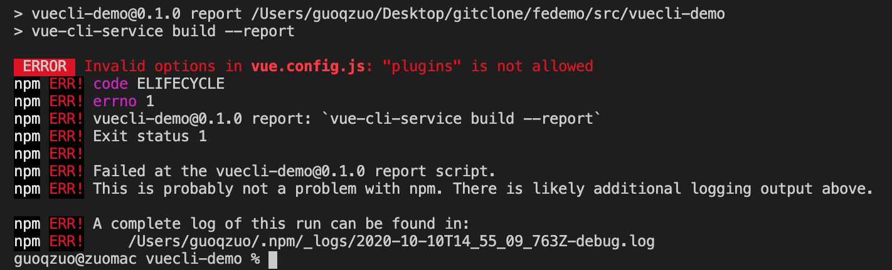

---
{
  "title": "vue.config.js: 'plugins' is not allowed",
  "staticFileName": "vue_cfg_plugins.html",
  "author": "guoqzuo",
  "createDate": "2020/11/30",
  "description": "在 vue.config.js 中，webpack 相关的配置需要写到 configureWebpack 里，不能直接写到外面，否则会报错：vue.config.js: 'plugins' is not allowed。",
  "keywords": "plugins is not allowed",
  "category": "Vue"
}
---
# vue.config.js: "plugins" is not allowed
在 vue.config.js 中，webpack 相关的配置需要写到 configureWebpack 里，不能直接写到外面，否则会报错：vue.config.js: 'plugins' is not allowed。



```js
// vue.config.js
module.exports = {
  plugins: [], // error，"plugins" is not allowed
  configureWebpack: {
    plugins: [], // 正确写法
    externals: {}
  }
};
```