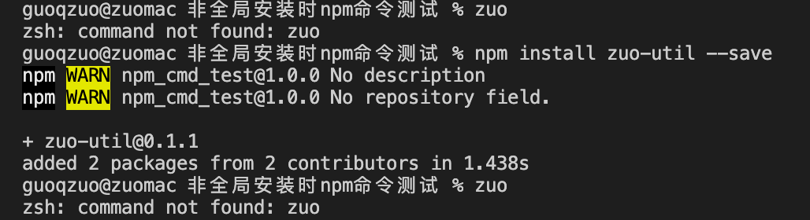
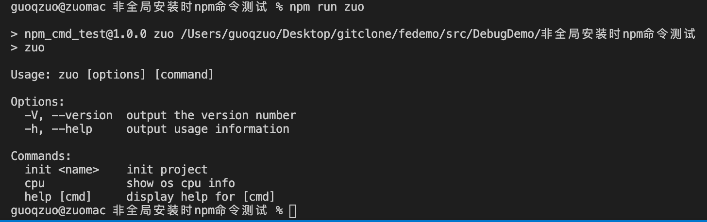
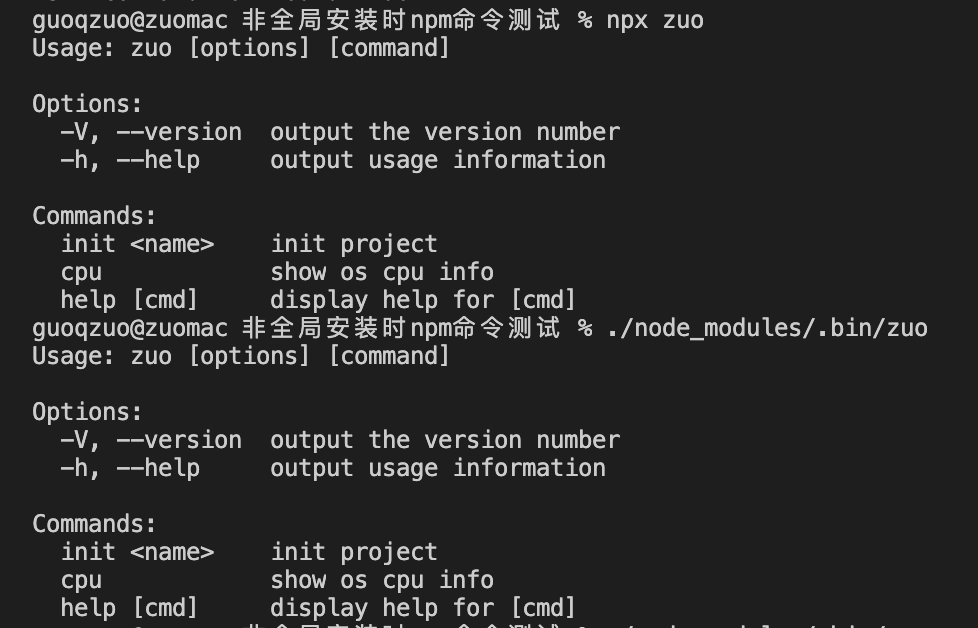

---
{
  "title": "不全局安装npm包，怎么在项目目录下局部执行对应的命令",
  "staticFileName": "npm_cmd_part.html",
  "author": "guoqzuo",
  "createDate": "2020/11/08",
  "description": "一般在 Vue 开发中，vue 命令可以执行，是因为全局安装了 `@vue/cli` npm包。假设你无法使用 npm install -g 全局安装，那怎么在当前项目所在的目录运行对应的命令呢？这里我们使用 zuo-util 这么 npm 包来介绍 3 种在项目种运行 npm 包命令的方法：1. npm run xxx 2. npx 命令 3. ./node_modules/.bin/命令",
  "keywords": "局部执行npm包命令,不全局安装npm包，怎么在项目中运行命令,局部执行命令",
  "category": "前端工程化"
}
---
# 不全局安装npm包，怎么在项目目录下局部执行对应的命令
一般在 Vue 开发中，vue 命令可以执行，是因为全局安装了 `@vue/cli` npm包。假设你无法使用 npm install -g 全局安装，那怎么在当前项目所在的目录运行对应的命令呢？这里我们使用 zuo-util 这么 npm 包来介绍 3 种在项目种运行 npm 包命令的方法：
1. npm run xxx
2. npx 命令 
3. ./node_modules/.bin/命令

先准备测试 demo
```bash
# 随便创建一个文件夹，并使用terminal进入到该目录，执行 npm init 创建 package.json
npm init
# 输入项目名，英文，这里用 npm_cmd_test，其他全部默认回车
# 运行 zuo 这个命令
zuo
# 找不到这个命令，说明全局没有安装 zsh: command not found: zuo
```
我们再局部安装下
```bash
# 项目里局部安装 zuo-util，非全局安装
npm install zuo-util --save
# 再运行 zuo，还是不行
zuo
```



我们可以使用下面三种方法来运行局部安装的npm包对应的命令

## npm run xxx
在 package.json 里的 scripts 里面，我们可以设置运行的命令
```js
// package.json
  "scripts": {
    "test": "echo \"Error: no test specified\" && exit 1",
    "zuo": "zuo"
  },
```
按照上面的代码设置后，npm run zuo 即可执行当前目录下的zuo命令



## npx 命令 
可以使用npx 命令名，执行项目中的，非全局的命令
```bash
npx zuo
```

## ./node_modules/.bin/命令
一般局部安装的命令都会放到 `./node_modules/.bin/` 目录下，可以通过 . 语法直接运行
```bash
./node_modules/.bin/zuo
```



