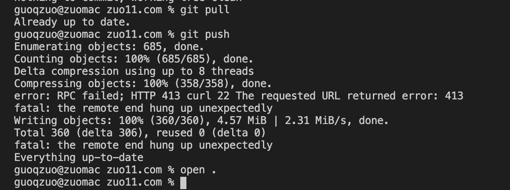
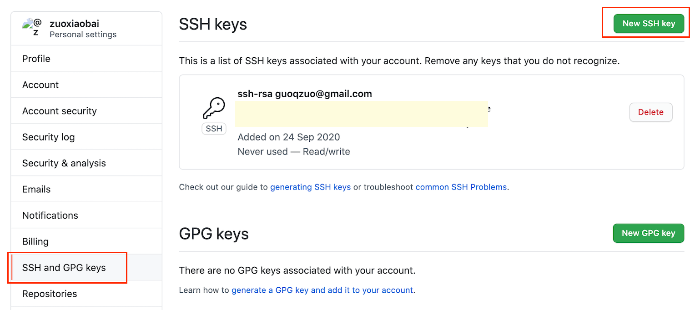

---
{
  "title": "使用git ssh方式解决RPC failed; HTTP 413 curl 22 The requested URL returned error: 413",
  "staticFileName": "git_http_413.html",
  "author": "guoqzuo",
  "createDate": "2020/11/16",
  "description": "由于改了博客生成系统的生成方式，每个html都改了，导致文件相对较多，也不算大，才 4.57 M, 但 git push 一直push不了，提示如下 error: RPC failed; HTTP 413 curl 22 The requested URL returned error: 413 fatal: the remote end hung up unexpectedly，网上查了下，可以改用 ssh 的方式 push 代码，结合之前的经验，大文件 git clone 不下来，可以换 ssh 方式 git clone。",
  "keywords": "RPC failed; HTTP 413 curl 22,The requested URL returned error: 413,fatal: the remote end hung up unexpectedly",
  "category": "运维部署与版本控制"
}
---
# 使用git ssh方式解决RPC failed; HTTP 413 curl 22 The requested URL returned error: 413
由于改了博客生成系统的生成方式，每个html都改了，导致文件相对较多，也不算大，才 4.57 M, 但 git push 一直push不了，提示如下

```js
error: RPC failed; HTTP 413 curl 22 The requested URL returned error: 413
fatal: the remote end hung up unexpectedly
```



网上查了下，可以改用 ssh 的方式 push 代码，结合之前的经验，大文件 git clone 不下来，可以换 ssh 方式 git clone。这条路应该可行。找了下之前的笔记 [使用ssh方式拉取代码的步骤](http://www.zuo11.com/blog/2020/8/git_ssh.html)，下面来梳理下整个过程。

**1. 使用git平台(这里是github)邮箱账号生成公钥和私钥**

```bash
# 先查看 github 对应的邮箱，user.email 就是git邮箱账号
git config -l
# credential.helper=osxkeychain
# user.name=guoqzuo
# user.email=guoqzuo@gmail.com
# core.quotepath=false

# 开始生成秘钥
ssh-keygen -t rsa -C 'guoqzuo@gmail.com'
# 全部默认、回车，也可以输入密码，我这里输入了密码，后面每次pull, push都需要输入密码。
# Generating public/private rsa key pair.
# Enter file in which to save the key (/Users/guoqzuo/.ssh/id_rsa): 
# Enter passphrase (empty for no passphrase): 
# Enter same passphrase again: 
# Your identification has been saved in /Users/guoqzuo/.ssh/id_rsa.
# Your public key has been saved in /Users/guoqzuo/.ssh/id_rsa.pub.

# 查看公钥内容，copy后到github里设置ssh key
cat ~/.ssh/id_rsa.pub 
```

**2. copy公钥，并配置到对应的git平台里（这里是github）**

登录 github，在个人设置里找到 ssh key，添加 ssh key，内容为 `cat ~/.ssh/id_rsa.pub` 后显示的内容



**3. 测试是否配置成功**

使用下面的命令，测试 github ssh key 是否配置成功，如果之前生成 key 时有输入 passphrase，这里就要输入

```bash
ssh -T git@github.com
# Enter passphrase for key '/Users/guoqzuo/.ssh/id_rsa': 
# Hi zuoxiaobai! You've successfully authenticated, but GitHub does not provide shell access.
```

**4. 将仓库http的origin地址，替换为ssh的origin地址**

```bash
# 查看 remote 地址
git remote -v
# origin  https://github.com.cnpmjs.org/zuoxiaobai/zuo11.com (fetch)
# origin  https://github.com.cnpmjs.org/zuoxiaobai/zuo11.com (push)

# 设置 remote 地址为对应仓库的 ssh 地址
git remote set-url origin git@github.com:zuoxiaobai/zuo11.com.git

# 查看设置是否生效
git remote -v                                                    
# origin  git@github.com:zuoxiaobai/zuo11.com.git (fetch)
# origin  git@github.com:zuoxiaobai/zuo11.com.git (push)
```

配置好后，再进行git pull, git push 就可以 push 成功了，虽然也有点慢，但至少不会报错。可以push成功

```bash
guoqzuo@zuomac zuo11.com % git pull
Enter passphrase for key '/Users/guoqzuo/.ssh/id_rsa': 
Already up to date.

guoqzuo@zuomac zuo11.com % git push
Enter passphrase for key '/Users/guoqzuo/.ssh/id_rsa': 
Enumerating objects: 685, done.
Counting objects: 100% (685/685), done.
Delta compression using up to 8 threads
Compressing objects: 100% (358/358), done.
Writing objects: 100% (360/360), 4.57 MiB | 150.00 KiB/s, done.
Total 360 (delta 306), reused 0 (delta 0)
remote: Resolving deltas: 100% (306/306), completed with 296 local objects.
To github.com:zuoxiaobai/zuo11.com.git
   85b3d21..bf8eab3  master -> master
guoqzuo@zuomac zuo11.com % 
```
