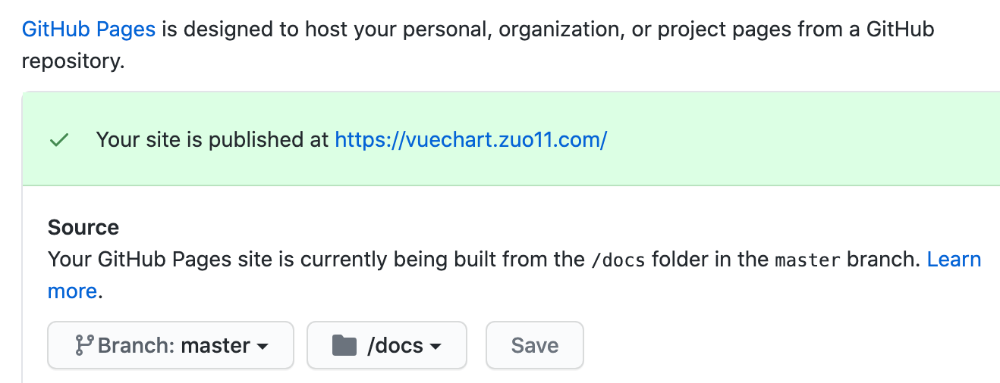
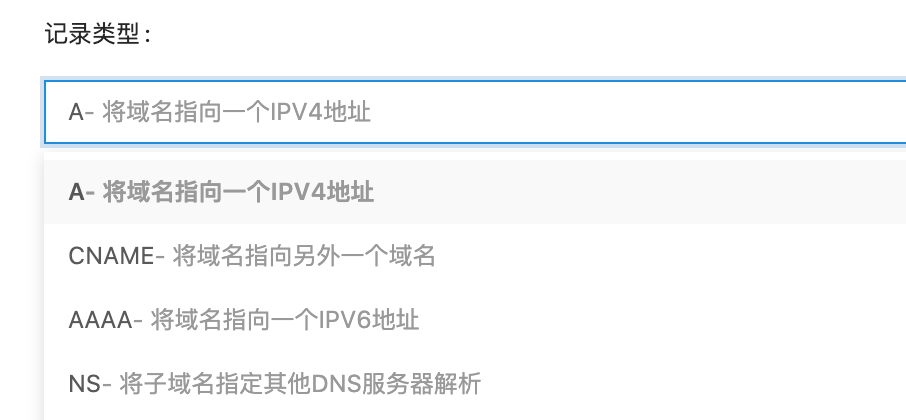
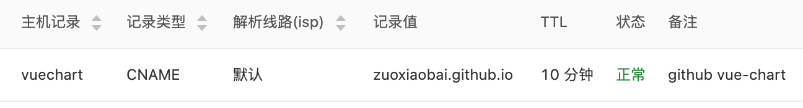

---
{
  "title": "GitHub Pages使用自定义域名开启HTTPS，配置CNAME解析",
  "staticFileName": "github_pages_https.html",
  "author": "guoqzuo",
  "createDate": "2020/12/07",
  "description": "一般在仓库的 Setting 中，开启 Github Pages 会生成一个 `xxx.github.io/xx/` 的地址，地址有点长，我们可以使用自定义域名，这里我将 vue-chart 这个仓库设置成了自定义域名 vuechart.zuo11.com。然后，我们需要把自定义的域名解析到 github.com 地址。可以使用 ping github.com 来获取它的服务器 IP。",
  "keywords": "github pages https",
  "category": "运维部署与版本控制"
}
---
# GitHub Pages使用自定义域名开启HTTPS，配置CNAME解析
一般在仓库的 Setting 中，开启 Github Pages 会生成一个 `xxx.github.io/xx/` 的地址，地址有点长，我们可以使用自定义域名，这里我将 vue-chart 这个仓库设置成了自定义域名 vuechart.zuo11.com。然后，我们需要把自定义的域名解析到 github.com 地址。可以使用 ping github.com 来获取它的服务器 IP。

获取 IP 后，我们到域名管理的位置，设置解析。
- 记录类型，就是域名的解析类型，最常见的是 `A` 类型，就是将域名解析到服务器 IP。`CNAME` 是将域名指向另一个域名
- 主机记录，就是域名前缀，`@` 表示 xx.com，`www` 表示 `www.xx.com`，一般设置这两种。`mail` 表示 mail.xx.com，代表二级域名。

解析到 github IP 后，可以正常用域名访问到。但开启 https 后，证书有问题。这时提示需要配置 CNAME 解析。于是就把 'A' 类型的解析改成 了 CNAME。将 zuo11.com 的二级域名 vuechart 解析到 zuoxiaobia.github.io，这样就可以使用 https 访问了，而且证书正常。

