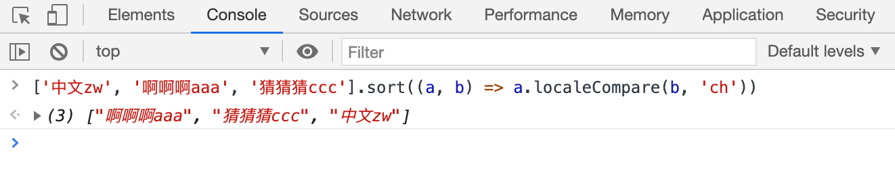

# JS 使用 localeCompare 函数对中文进行首字母排序
> tag: js中文按首字母排序, 前端中文按首字母排序,前端中文排序

String.prototype.localeCompare(compareString[, locales[, options]]) 该方法用于对字符串进行排序。第二个参数 locales 可以指定语言，中文排序传 'ch' 即可。它的返回值为 -1, 1, 0 ，与 sort 自定义排序的返回值基本一致。来看一个例子

```js
['中文zw', '啊啊啊aaa', '猜猜猜ccc'].sort((a, b) => a.localeCompare(b, 'ch'))
//  ["啊啊啊aaa", "猜猜猜ccc", "中文zw"]
```



参考：
- [String.prototype.localeCompare() | MDN](https://developer.mozilla.org/zh-CN/docs/Web/JavaScript/Reference/Global_Objects/String/localeCompare)
- [js中文按首字母排序](https://blog.csdn.net/stone10086/article/details/83752227)