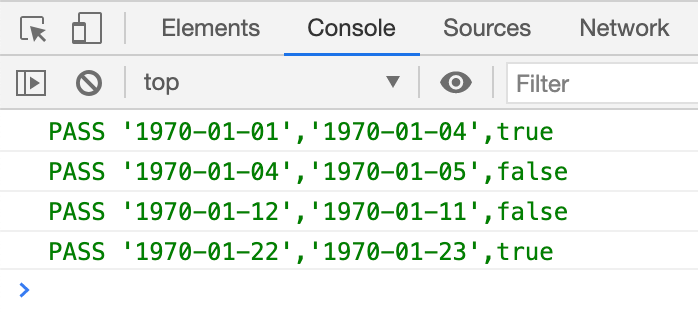

---
{
  "title": "JS 判断两个日期是否是同一周，带单元测试",
  "staticFileName": "js_same_week.html",
  "author": "guoqzuo",
  "createDate": "2020/12/07",
  "description": "给定两个日期，怎么判断他们是同一周呢？核心是 **所有时间都是从 1970年1月1日(周4) 开始，计算出当前时间距离该日期的天数，再用 (天数 + 4)/7 就是周数，如果相同则是同一周**，这里会有一个特殊情况，就是周日的时候，需要特殊处理。判断时只需要日期，不要输入时间，默认都是以 '08:00:00' 为准。",
  "keywords": "判断两个时间是否是同一周,判断两个日期是否是同一周",
  "category": "JavaScript"
}
---
# JS 判断两个日期是否是同一周，带单元测试
给定两个日期，怎么判断他们是同一周呢？核心是 **所有时间都是从 1970年1月1日(周4) 开始，计算出当前时间距离该日期的天数，再用 (天数 + 4)/7 就是周数，如果相同则是同一周**，这里会有一个特殊情况，就是周日的时候，需要特殊处理。判断时只需要日期，不要输入时间，默认都是以 '08:00:00' 为准。

```js
/**
 * @description 判断两个时间是否是同一周
 * 所有时间都是从 1970年1月1日(周4) 开始，(天数 + 4)/7 就是周数，如果相同则是同一周
 * 特殊情况：周日会是整数，如果直接取整，周日会和下周一是同一天
 * (+new Date('1970-01-01') / oneDay) + 4 / 7  // 周四 = 0.57
 * (+new Date('1970-01-04') / oneDay) + 4 / 7  // 周日 = 1
 * (+new Date('1970-01-05') / oneDay) + 4 / 7  // 周一 = 1.14
 * @params { Stirng } timeA '1970-01-03'
 * @params { Stirng } timeB '1970-01-22'
 */
function isSameWeek(timeA, timeB) {
  let weekIndexA = getWeekIndex(timeA)
  let weekIndexB = getWeekIndex(timeB)
  let tempArr = [weekIndexA, weekIndexB].sort((a, b) => a - b)
  // 如果有周日，间隔 < 1，则是 [1.9, 2] 或 [1, 1.14]，
  // 较大的数为整数则是同一周。间隔 >=1 则不是同一周
  if (tempArr.some(item => Number.isInteger(item))) {
    return tempArr[1] - tempArr[0] < 1 ? Number.isInteger(tempArr[1]) : false
  } else {
    return parseInt(weekIndexA) === parseInt(weekIndexB)
  }
  // 获取周数
  function getWeekIndex(time) {
    let oneDayTime = 24 * 3600 * 1000
    let dayCount = time.getTime() / oneDayTime
    let weekCount = (dayCount + 4) / 7
    return weekCount
  }
}
```
单元测试
```js
// isSameWeek 单元测试
function isSameWeekTest() {
  let list = [
    { a: '1970-01-01', b: '1970-01-04', result: true },
    { a: '1970-01-04', b: '1970-01-05', result: false },
    { a: '1970-01-12', b: '1970-01-11', result: false },
    { a: '1970-01-22', b: '1970-01-23', result: true },
  ]
  list.forEach(item => {
    let res = isSameWeek(new Date(item.a), new Date(item.b)) === item.result
    console.log(
      `%c${res ? 'PASS' : 'FAIL'} '${item.a}','${item.b}',${item.result}`,
      `color: ${res ? 'green' : 'red'}`
    )
  })
}
// Run
isSameWeekTest()
```

运行效果:




