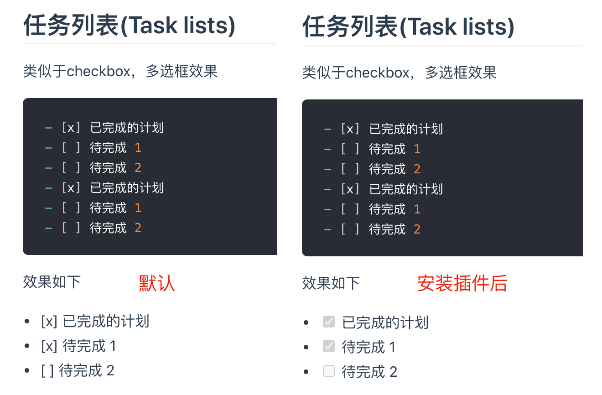

# VuePress 复选框、任务列表不生效怎么处理
在写 markdown 笔记时，复选框、任务列表（task list）功能在本地 Typora 是生效的，但在 VuePress 中无法正常显示。于是在 Github 对应的 issue 里面搜索 Task lists，找到了解决方法：需要安装一个 markdown 插件 `markdown-it-task-lists`
```markdown
- [x] 已完成的计划
- [ ] 待完成 1
- [ ] 待完成 2
- [x] 已完成的计划
- [ ] 待完成 1
- [ ] 待完成 2
```
插件安装
```bash
npm install markdown-it-task-lists -D
```
修改配置
```js
// config.js
module.exports = {
  markdown: {
    plugins: ['task-lists']
  }
}
```
完全退出 dev，再重新开启服务后，就正常了，对比图如下：



参考: [怎么实现复选框功能 · Issue #2364 · vuejs/vuepress](https://github.com/vuejs/vuepress/issues/2364)