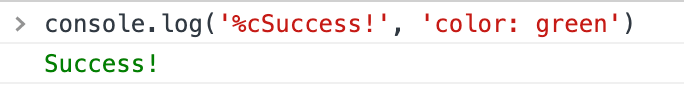

# console.log 打印带样式的文字、图片
console.log 的第一个参数中，如果有 '%c'，表示设置样式，会将第二个参数的 css 样式字符串应用到第一个参数的内容中
```js
console.log('%c文字', 'css样式')
```
这样可以打印绿色的文字
```js
console.log('%cSuccess!', 'color: green')
```



不仅可以设置文字颜色，还可以通过设置 background-color 在控制台显示图片

```js
if (console) {
  console.clear();
  console.log("%c ", "padding:112px 150px;background:url('https://images.cnblogs.com/cnblogs_com/enumx/1647344/o_200214113324console.gif') no-repeat;");
  console.log('%cWelcome', 'color: #0000ff;font-size: 20px;font-weight: bold;');
}
```

效果如下


参考：[console.log输出字体颜色 - enumx - 博客园](https://www.cnblogs.com/enumx/p/12308528.html)