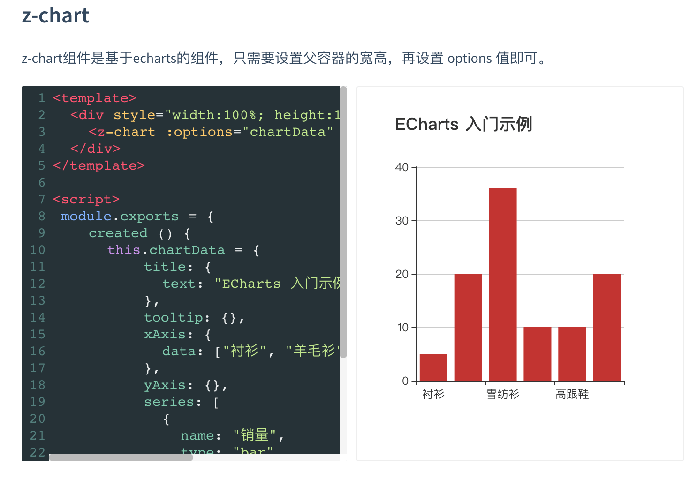

---
{
  "title": "docsify嵌入vue echarts组件无法显示图表的问题",
  "staticFileName": "dosify_vue_echarts.html",
  "author": "guoqzuo",
  "createDate": "2020/12/07",
  "description": "在使用 docsify 自带的 vue 功能加载 echarts 相关的 vue 组件时，图表都无法正常显示。后来打印 log 发现，最终渲染到页面的 echarts div并不是 vue 初始化之后，进行绘制的 div，而是一个拷贝后的副本，所以图片显示不出来。 需要使用 vuep 插件才行。实例参考 https://vuechart.zuo11.com，效果如下图:",
  "keywords": "docsify echarts vue组件无法正常显示",
  "category": "Vue"
}
---
# docsify嵌入vue echarts组件无法显示图表的问题
在使用 docsify 自带的 vue 功能加载 echarts 相关的 vue 组件时，图表都无法正常显示。后来打印 log 发现，**最终渲染到页面的 echarts div并不是 vue 初始化之后，进行绘制的 div，而是一个拷贝后的副本，所以图片显示不出来。** 需要使用 vuep 插件才行。实例参考 https://vuechart.zuo11.com ，效果如下图:



对应的 markdown 文件内容如下

```markdown
### z-chart
z-chart组件是基于echarts的组件，只需要设置父容器的宽高，再设置 options 值即可。
<!-- markdown文档里插入vuep代码 -->

<vuep template="#basicBar"></vuep>
<script v-pre type="text/x-template" id="basicBar">
<template>
  <div style="width:100%; height:100%;">
    <z-chart :options="chartData" />
  </div>
</template>

<script>
 module.exports = {
    created () {
      this.chartData = {
          title: {
            text: "ECharts 入门示例"
          },
          tooltip: {},
          xAxis: {
            data: ["衬衫", "羊毛衫", "雪纺衫", "裤子", "高跟鞋", "袜子"]
          },
          yAxis: {},
          series: [
            {
              name: "销量",
              type: "bar",
              data: [5, 20, 36, 10, 10, 20]
            }
          ]
        }
    }
  }
</script>
```
注意在 index.html 里面需要引入 vuep，以及其他你需要的组件
```html
<script src="//cdn.jsdelivr.net/npm/vue/dist/vue.min.js"></script>
<script src="//unpkg.com/vuep/dist/vuep.min.js"></script>
<script src="https://cdn.bootcdn.net/ajax/libs/echarts/4.8.0/echarts-en.common.min.js"></script>
<script src="https://unpkg.com/@guoqzuo/vue-chart@latest/lib/vue-chart.umd.min.js"></script>
```