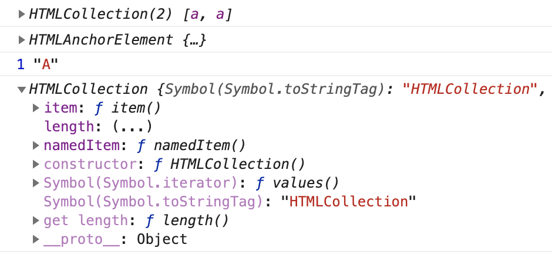
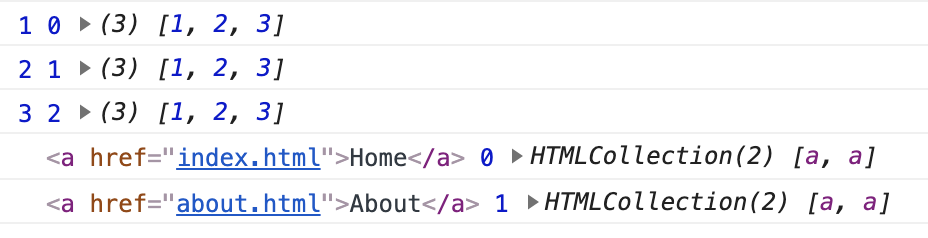
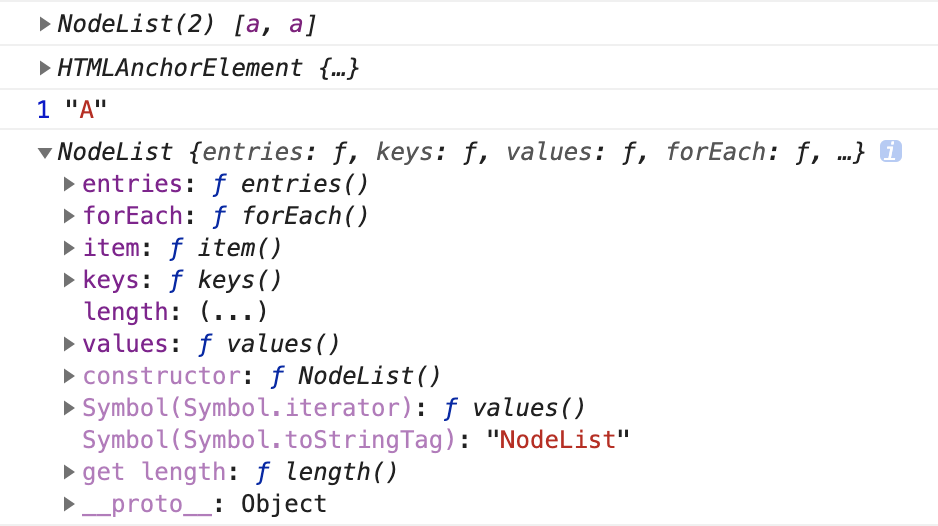

---
{
  "title": "getElementsByTagName 结果为什么不可以 forEach ？和 querySelectorAll 有什么区别",
  "staticFileName": "dom_arr_forEach.html",
  "author": "guoqzuo",
  "createDate": "2020/12/15",
  "description": "在 JS DOM 编程艺术的例子中，看到 `document.getElementsByTagName` 后使用了 `Array.from(xx)` 将其结果转为标准数组后再使用 `forEach`。下面写个例子来验证为什么？从上面的例子中，我们可以看到 `getElementsByTagName` 函数返回的数据类型是 `HTMLCollection`，类数组对象，并没有实现 forEach 方法，但它内部实现了迭代 for...of（Symbol.iterator）方法，因此可以使用 for、for...of 来遍历",
  "keywords": "getElementsByTagName,querySelectorAll",
  "category": "JavaScript"
}
---
# getElementsByTagName 的结果为什么不可以 forEach ？和 querySelectorAll 有什么区别
在 JS DOM 编程艺术的例子中，看到 `document.getElementsByTagName` 后使用了 `Array.from(xx)` 将其结果转为标准数组后再使用 `forEach`。下面写个例子来验证为什么？

```html
 <nav>
  <ul>
    <li><a href="index.html">Home</a></li>
    <li><a href="about.html">About</a></li>
  </ul>
</nav>
<script>
  let nav = document.getElementsByTagName('nav')[0]
  let linkArr = nav.getElementsByTagName('a')
  console.log(linkArr) // HTMLCollection [] => Object
  console.log(linkArr[0].__proto__)  // HTMLAnchorElement
  // HTMLAnchorElement => HTMLElement => Element => Node => EventTarget => Object
  // <nav> HTMLElement
  // <li> HTMLLIElement 
  console.log(linkArr[0].nodeType, linkArr[0].nodeName) // 1 "A"
  console.log(linkArr.__proto__) // HTMLCollection [] 

  // Uncaught TypeError: linkArr.forEach is not a function
  linkArr.forEach(item => console.log(item))
</script>
```

## getElementsByTagName返回结果类型 
从上面的例子中，我们可以看到 `getElementsByTagName` 函数返回的数据类型是 `HTMLCollection`，类数组对象，并没有实现 forEach 方法，但它内部实现了迭代 for...of（Symbol.iterator）方法，因此可以使用 for、for...of 来遍历



我们换个思路，使用 `Array.prototype.forEach.call` 来调用试试

```js
// forEach 基本用法
[1,2,3].forEach((item, index, array) => console.log(item, index, array))

// 使用 prototype.forEach 直接运行
let cb = (item, index, array) => console.log(item, index, array)
Array.prototype.forEach.call(linkArr, cb)
```
可以正常执行，执行结果如下图。因此 Array 下的一些方法，我们可以使用 prototype 方式使用



## querySelectorAll返回结果类型

同样是获取元素列表，`querySelectorAll` 返回的结果类型是 `NodeList`
```js
// 和 querySelectorAll 对比
let linkArr2 = document.querySelectorAll('li a')
console.log(linkArr2) // NodeList [] => Object
console.log(linkArr2[0].__proto__)  //  HTMLAnchorElement
console.log(linkArr2[0].nodeType, linkArr2[0].nodeName) // 1
console.log(linkArr2.__proto__) // NodeList [] 
linkArr2.forEach(item => console.log(item))
```

如下图，NodeList 类型实现了 forEach, for...of 等方法，所以可以直接使用 forEach 遍历



他们的区别：
- getElementsByTagName 返回的结果为 `HTMLCollection` 类型，而 querySelectorAll 返回的结果为 `NodeList`。HTMLCollection 并没有实现 forEach，无法使用点语法执行forEach，而 NodeList 是可以的。
- getElementsByTagName 返回的 HTMLCollection 是根据 dom 的变动实时更新的，而 querySelectorAll 不是动态的，它只是一个静态副本。