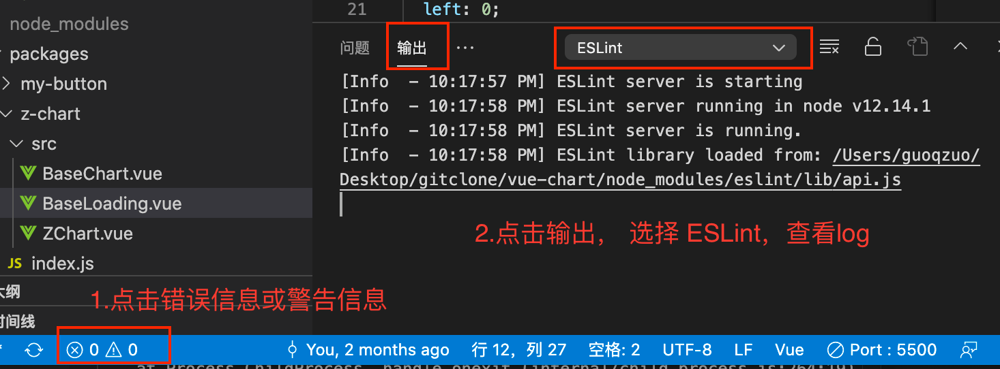
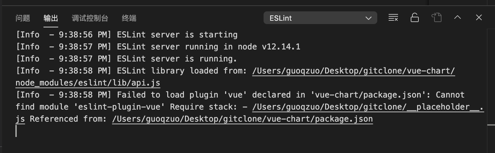

# vscode配置了自动fix突然失效了，或者一直生效不了，怎么看对应的log
你是否会遇到下面的问题：在 vscode 里面安装了 eslint 插件后，正确设置了保存后自动 fix 参数，但没有生效。或者之前是生效的，忽然就不生效了。

只要你的配置是没有问题的，那就是插件依赖的包加载异常了，一般都重启 vscode 一次或多次就 Ok 了。我们可以通过下面两个步骤，查看 eslint 插件对应的 log。
1. 点击 vscode 右下角的错误信息、警告信息图标，看是信息里是否有 eslint 相关报错
2. 点击 输出 - 选择 ESLint 就可以看 ESLint 相关 log 了。

下图是 ESLint 正常加载的 log

下图是 eslint 失效后，查看 输出 - ESLint log 报的错误。提示 eslint-plugin-vue 找不到，一般就是 vscode 内部加载失败了。将 vscode 完全退出，再打开，或者将项目单独用一个新窗口打开就又正常了。

