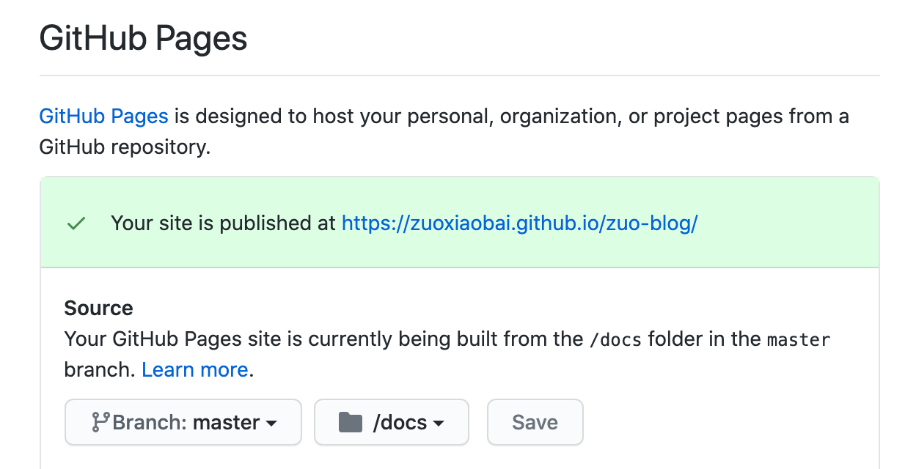

---
{
  "title": "xx.github.io仓库配置Github pages后对其他仓库Github pages的影响",
  "staticFileName": "github-io.html",
  "author": "guoqzuo",
  "createDate": "2020/12/07",
  "description": "在 github 中，假设我们创建了 'github用户名.github.io' 仓库，开启 Github Pages 后，访问该域名，就指向了这个仓库的文件。这时如果你的其他仓库也开启了 Github Pages，那么对于的目录解析可能会有问题。以我的 github 账号 zuoxiaobai 为例，如果 zuoxiaobai.github.io 这个仓库开启 pages，再把另一个仓库 zuo-blog 也开启 pages，那么访问 `https://zuoxiaobai.github.io/zuo-blog/` 并不能自动跳转到对应的 index.html，而是提示 404。需要访问 `https://zuoxiaobai.github.io/zuo-blog/index.html` 才行。这里我直接把 zuoxiaobai.github.io 的仓库关掉了 Github Pages。这样 `https://zuoxiaobai.github.io/zuo-blog/` 才能自动解析目录下的 index.html。",
  "keywords": "github.io仓库开启pages后对其他仓库pages的影响",
  "category": "运维部署与版本控制"
}
---
# xx.github.io仓库配置Github pages后对其他仓库Github pages的影响
在 github 中，假设我们创建了 `github用户名.github.io` 仓库，开启 Github Pages 后，访问该域名，就指向了这个仓库的文件。这时如果你的其他仓库也开启了 Github Pages，那么对于的目录解析可能会有问题。

以我的 github 账号 zuoxiaobai 为例，如果 zuoxiaobai.github.io 这个仓库开启 pages，再把另一个仓库 zuo-blog 也开启 pages，那么访问 `https://zuoxiaobai.github.io/zuo-blog/` 并不能自动跳转到对应的 index.html，而是提示 404。需要访问 `https://zuoxiaobai.github.io/zuo-blog/index.html` 才行。这里我直接把 zuoxiaobai.github.io 的仓库关掉了 Github Pages。这样 `https://zuoxiaobai.github.io/zuo-blog/` 才能自动解析目录下的 index.html。