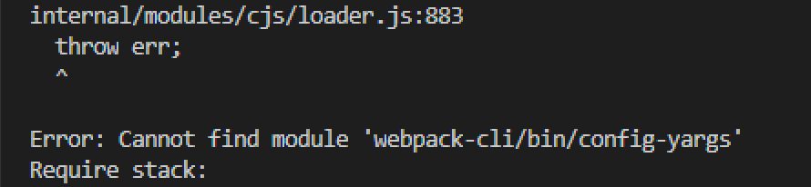

---
{
  "title": "两种方法解决Error: Cannot find module 'webpack-cli-bin-config-yargs'",
  "staticFileName": "webpack_dev_server_err.html",
  "author": "guoqzuo",
  "createDate": "2020/12/07",
  "description": "两种方法解决Error: Cannot find module 'webpack-cli/bin/config-yargs', 在运行 webpack-dev-server 这个命令时，如果出现了 Error: Cannot find module 'webpack-cli/bin/config-yargs' 这个错误，是因为默认情况下 webpack-dev-server 执行依赖 webpack-cli 包目录下的 bin/config-yargs，但 webpack-cli 4.1.0 的版本，做了一些调整，删除了这个文件，导致了这个错误。",
  "keywords": "Error: Cannot find module 'webpack-cli/bin/config-yargs'",
  "category": "前端工程化"
}
---
# 两种方法解决Error: Cannot find module 'webpack-cli/bin/config-yargs'
在运行 webpack-dev-server 这个命令时，如果出现了 Error: Cannot find module 'webpack-cli/bin/config-yargs' 这个错误，是因为默认情况下 webpack-dev-server 执行依赖 webpack-cli 包目录下的 bin/config-yargs，但 webpack-cli 4.1.0 的版本，做了一些调整，删除了这个文件，导致了这个错误。



```json
"webpack": "^5.1.3",
"webpack-cli": "^4.1.0",
"webpack-dev-server": "^3.11.0"
```
有两种解决方法
1. 将 webpack-cli 降级到 3.x版本, "webpack-cli": "^ 3.3.12"
2. 使用 webpack 5.x 中用于替代 webpack-dev-server 命令的 webpack serve 命令。其实它内部还是使用的 webpack-dev-server 这个包

```js
// package.json scripts
"dev:server": "webpack serve --config webpack.dev.js"
```

参考：[Error: Cannot find module 'webpack-cli/bin/config-yargs' · Issue #1948 · webpack/webpack-cli](https://github.com/webpack/webpack-cli/issues/1948)
