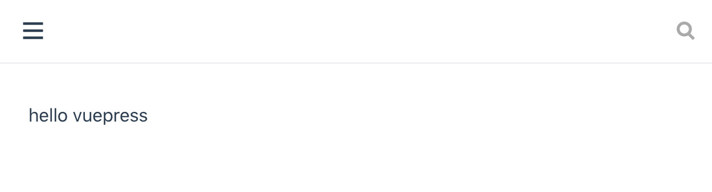
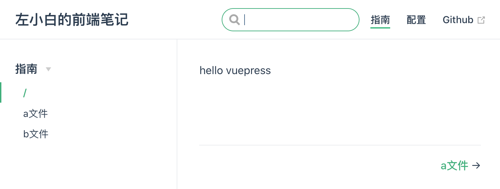
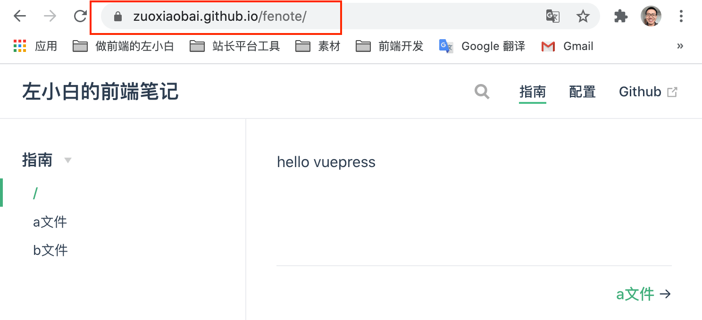

---
{
  "title": "使用 VuePress 生成静态网站并部署到 Github Pages",
  "staticFileName": "vuepress.html",
  "author": "guoqzuo",
  "createDate": "2020/12/15",
  "description": "VuePress 是一个静态网站生成器，诞生初衷是为了支持 Vue 及其子项目的文档需求。目前 Vue 相关文档都是由 vuepress 搭建。相比其他静态站点生成工具，Docsify 是运行时驱动，通过 JS 加载内容，对 SEO 不够友好。VuePress 类似于 Hexo，主要区别是 VuePress 是由 Vue 驱动。",
  "keywords": "VuePress,VuePress 创建网站,vuepress 使用",
  "category": "Vue"
}
---
# 使用VuePress生成静态网站并部署到Github Pages
[VuePress](https://www.vuepress.cn/guide/#%E5%AE%83%E6%98%AF%E5%A6%82%E4%BD%95%E5%B7%A5%E4%BD%9C%E7%9A%84) 是一个静态网站生成器，诞生初衷是为了支持 Vue 及其子项目的文档需求。目前 Vue 相关文档都是由 vuepress 搭建。相比其他静态站点生成工具，Docsify 是运行时驱动，通过 JS 加载内容，对 SEO 不够友好。VuePress 类似于 Hexo，主要区别是 VuePress 是由 Vue 驱动的。

VuePress 的比较好的地方：
1. 丰富的 Markdown 扩展、主题风格优雅
2. 可以使用插件支持 PWA
3. 支持 vue 组件，SEO 友好

现在以 `zuoxiaobai/fenote` Github 仓库为例，为该仓库搭建一个官网

核心目录结构如下，完整目录结构参考 [VuePress 目录结构](https://www.vuepress.cn/guide/directory-structure.html#%E7%9B%AE%E5%BD%95%E7%BB%93%E6%9E%84)

```bash
├── docs  # docs 是文档项目名称，也可以自己命名 
│   ├── .vuepress # .vuepress 配置、构件生成目录
│   ├── README.md # 默认的首页
│   ├── 其他markdown目录及文档
└── package.json
```

它的本质就是，先按照指定的目录格式，写好 Markdown 及配置。然后使用 vuepress dev docs 命令生成静态站点，生成目录默认为 docs/.vuepress/dist。另外它还提供了开发服务器，运行 vuepress dev docs 可以实时看页面效果。

由于需要使用 vuepress 命令，我们为了方便后期维护迭代，一般不推荐全局安装 vuepress。在项目内安装即可。如果项目根目录没有 package.json，那就需要自己创建一个了。

```bash
# 初始化一个 package.json，如果这个文件存在，可跳过
npm init   
# 安装 vuepress 开发依赖
npm install vuepress -D # --save-dev
```
在 package.json 里面添加下面两条命令的快捷方式，这样就可以使用 npm run docs:dev，以及 npm run docs:build 来运行或构件静态站点了。
```js
"scripts": {
  "docs:dev": "vuepress dev docs",
  "docs:build": "vuepress build docs"
},
```
下面按照上面的目录结构，把 docs、.vuepress文件夹，以及 README.md 创建好，REAMEME.md 写一个 hello vuepress。运行 npm run docs:dev 它默认会在本地开启 8080 端口服务，访问效果如下图



可以看到标题、右上角导航栏、左侧菜单都没有出来。这就需要在 .vuepress/confing.js 写对应的配置了。你需要关系 4 点：
1. title 用于配置左上角标题
2. themeConfig.sidebar 用于配置右上角的导航栏
3. themeConfig.nav 用于配置左侧菜单
4. 首页默认是 docs/README.md，`/` 表示 docs 目录，比如：`/a.md` 表示 `dosc/a.md`

```js
// .vuepress/config.js
module.exports = {
  // base: '/fenote/',
  title: '左小白的前端笔记',
  description: '左小白的前端笔记，用于记录、完善个人前端知识体系结构',
  themeConfig: {
    sidebar: [
      {
        title: '指南',
        children: [
          '/',
          '/a.md',
          '/b.md'
        ]
      }
    ],
    nav: [
      { text: '指南', link: '/' },
      { text: '配置', link: '/config.md' },
      { text: 'Github', link: 'https://www.github.com/zuoxiaobai/fenote' }
    ]
  }
}
```
我们按照上面的配置文件写好后，在 docs 目录下创建 a.md，b.md，a.md 如下
```markdown
# a文件

a.md
```
由于 npm run build:dev 后，它支持类似 HMR 热模块加载的功能，修改后，会自动重新构建。根据上面的配置好后，效果如下



这样我们就可以根据自己的需要，规划顶部导航以及左侧菜单了。更多配置、markdown扩展语法参见：[基本配置 | VuePress](https://www.vuepress.cn/guide/basic-config.html#%E9%85%8D%E7%BD%AE%E6%96%87%E4%BB%B6)

这样写好后，只能本地运行，怎么部署到 Github Pages 呢？VuePress官网提供一个部署脚本，可以放到项目根目录 deploy.sh

```bash
#!/usr/bin/env sh

# 确保脚本抛出遇到的错误
set -e

# 生成静态文件
npm run docs:build

# 进入生成的文件夹
cd docs/.vuepress/dist

# 如果是发布到自定义域名
# echo 'www.example.com' > CNAME

# 在新生成的目录下初始化 .git，并 add 所有文件，提交到该目录下项目的本地master分支(默认)
git init
git add -A
git commit -m 'deploy'

# 如果发布到 https://<USERNAME>.github.io
# git push -f git@github.com:<USERNAME>/<USERNAME>.github.io.git master

# 如果发布到 https://<USERNAME>.github.io/<REPO>
# git push -f git@github.com:<USERNAME>/<REPO>.git master:gh-pages
# zuoxiaobai/fenote 对应的配置如下，将doscs/.vuepress/dist 目录下的 master 分支 push 到 fenote 远程远程仓库的 gh-pages 分支
git push -f git@github.com:zuoxiaobai/fenote.git master:gh-pages

cd -
```
在 mac 下，新建的 deploy.sh 默认没有可执行权限，需要 `chmod +x deploy.sh`，这样就可以 ./deploy.sh 直接部署了。

注意：如果发布到 `https://<USERNAME>.github.io/<REPO>`，且没有使用自定义域名。则需要修改 config.js 的 base 配置为对应的仓库名
```js
module.exports = {
  base: '/fenote/', 
  title: '左小白的前端笔记',
  // ...
}
```

运行 ./deploy.sh，部署成功后，可以通过 `https://zuoxiaobai.github.io/fenote/` 来访问了，如下图



**注意：目前由于部署到了 `fe.zuo11.com` 二级域名上，`github.io` 的链接已无法访问**