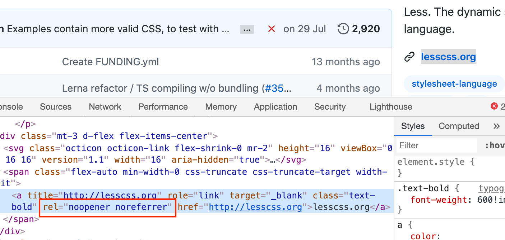
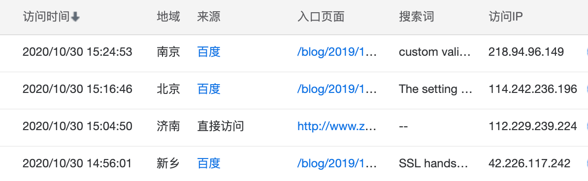

---
{
  "title": "外部链接 a 标签为什么要加 noreferer 与 noopener ？",
  "staticFileName": "a_noreferrer.html",
  "author": "guoqzuo",
  "createDate": "2020/12/15",
  "description": "一般页面的外部链接 a 标签都会加上 ref='noreferrer noopener'，这样可以避免一些安全问题，下面通过几个问题来具体看看 1. a 标签加上 noreferrer 和 noopener 后会有什么效果？2. Referer 是什么？有什么应用场景? 3. window.opener 可以做什么？",
  "keywords": "noreferrer和noopener,noreferrer,noopener,测试tag",
  "category": "http与https"
}
---
# 外部链接 a 标签为什么要加 noreferrer 与 noopener ？
一般页面的外部链接 a 标签都会加上 `ref="noreferrer noopener"`，这样可以避免一些安全问题，下面通过几个问题来具体看看
1. a 标签加上 noreferrer 和 noopener 后会有什么效果？
2. Referer 是什么？有什么应用场景?
3. window.opener 可以做什么？

## a 标签加上 noreferrer 和 noopener 后会有什么效果？

以 Github 上 less.js 仓库设置的网站链接为例，如上图。加了这两个参数后点击链接，该页面打开后
- 请求头（Request Headers）部分的 Referer 和直接访问的 Referer 一致，都为空，不会携带来源信息。
- window.opener 和直接访问该网站一致，无法获取来源网站信息，无法操作来源网站的跳转等

## 请求头 Referer 的作用是什么？

一般网页在加载html、js、css、图片等静态资源发送请求时，**请求头部分会有一个 Referer 字段，用于标记请求来源**。referer 单词存在拼写错误，本意是打算使用 referrer，写错了。后来为了兼容，将错就错，还是保留了错误的拼写方式。

Referer可以标记请求来源，有以下几个应用场景
- **用于统计分析中页面来源**，可以知道用户是从哪种方式进入网站的。搜索引擎一般不会开启 noreferrer，比如百度统计可以知道你是通过哪个关键字进入的页面。

- **用于防盗链**，防止网页静态资源被其他站点直接引用，如淘宝店铺图片、CDN图片链接、文件、视频链接等。一般会设置 referer 白名单，仅允许白名单内的 Referer 访问，否则禁止访问。减少服务器负载或不必要的 CDN 流量花费。

- **用于鉴权**，比如页面在集成评论系统、Google AdSense等第三方功能时，会校验站点与ID是否匹配，如果不匹配会提示 403。防止其他网站引入对应的代码后，导致数据错乱。我们在处理接口请求时，也可以对 Referer 值进行判断，禁止某些来源访问接口。

## window.opener 可以做什么？

window.opener 可以拿到来源网站的 window 对象，虽然一般访问 dom 等有跨域限制，但 window.opener.location.href 可以直接重定向源网站，使来源站点发生变化。使用 noopener 可以避免一些安全风险。

参考：
- [你了解Referer吗 - 云+社区 - 腾讯云](https://cloud.tencent.com/developer/article/1555507)
- [防盗链_访问控制_数据安全_开发指南_对象存储 OSS-阿里云](https://help.aliyun.com/document_detail/31869.html?spm=5176.8466010.referer.1.1e611450esasVK)
