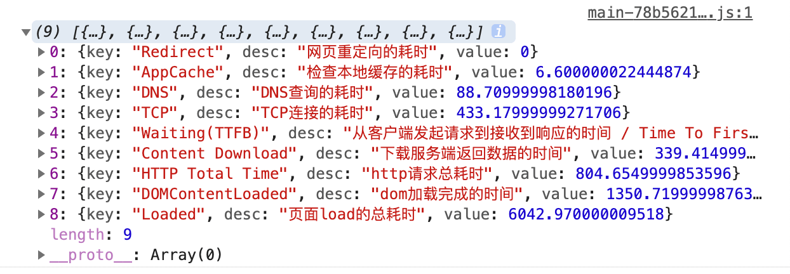
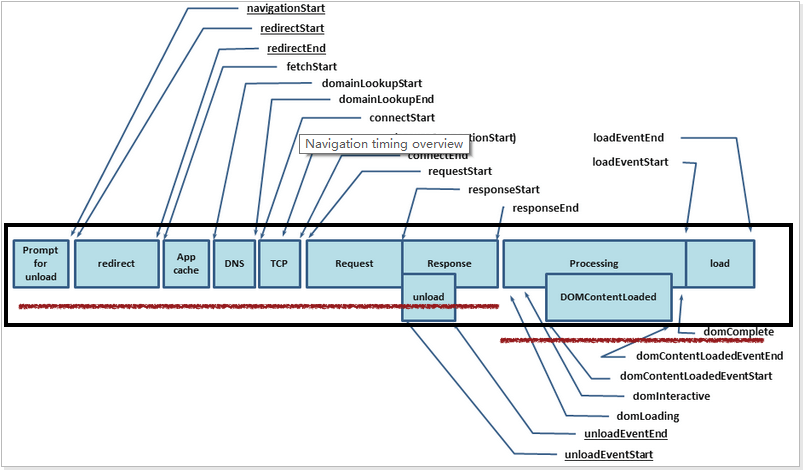

# 通过 performance.timing 简单理解浏览器输入 url 到页面显示全过程

performance.timing 记录了在浏览器中输入 url 到页面显示整个过程中各个关键节点的时间。包括：网页重定向的耗时、检查本地缓存的耗时、DNS查询的耗时、TCP连接的耗时、dom 加载完成的时间、页面 load 的总耗时等。performance.timing 是 PerformanceTiming 对象的实例。下面我们通过了解 performance.timing 各个字段的意思来实现下面图片的功能。



首先我们来看一张非常重要的图，下图是页面打开过程中 performance.timing 各字段所在的位置



按照顺序对各个字段的解释：
- `navigationStart: 1607492537332` 同一个浏览器上一个页面卸载结束时的时间戳。如果没有上一个页面的话，那么该值会和 fetchStart 的值相同。
- `redirectStart: 0` 第一个 HTTP 重定向开始的时间戳。如果没有重定向，或者重定向到一个不同源的话，那么该值返回为 0。
- `redirectEnd: 0` 最后一个 HTTP 重定向完成时的时间戳。如果没有重定向，或者重定向到一个不同的源，该值也返回为 0。
- `fetchStart: 1607492537338` 浏览器准备好使用 http 请求的时间(发生在检查本地缓存之前)。
- `domainLookupStart: 1607492537349` DNS 域名查询开始的时间，如果使用了本地缓存（即无 DNS 查询）或持久连接，则与 fetchStart 值相等
- `domainLookupEnd: 1607492537403` DNS 域名查询结束的时间，如果使用了本地缓存（即无 DNS 查询）或持久连接，则与 fetchStart 值相等
- `connectStart: 1607492537403` HTTP（TCP）开始/重新 建立连接的时间，如果是持久连接，则与 fetchStart 值相等。
- `secureConnectionStart: 1607492537472` HTTPS 连接开始的时间，如果不是安全连接，则值为 0。
- `connectEnd: 1607492537600` HTTP（TCP） 完成建立连接的时间（完成握手），如果是持久连接，则与 fetchStart 值相等。
- `requestStart: 1607492537601` HTTP 请求读取真实文档开始的时间（完成建立连接），包括从本地读取缓存。
- `responseStart: 1607492537841`  HTTP 开始接收响应的时间（获取到第一个字节），包括从本地读取缓存。
- `responseEnd: 1607492537996` HTTP 响应全部接收完成的时间（获取到最后一个字节），包括从本地读取缓存。
- `unloadEventStart: 0` 前一个网页（和当前页面同域）unload的时间戳，如果没有前一个网页或前一个网页是不同的域的话，那么该值为0.
- `unloadEventEnd: 0` 前一个页面 unload 时间绑定的回掉函数执行完毕的时间戳。
- `domLoading: 1607492537852` 开始解析渲染 DOM 树的时间，此时 Document.readyState 变为 loading，并将抛出 readystatechange 相关事件。
- `domInteractive: 1607492538002`  完成解析 DOM 树的时间，Document.readyState 变为 interactive，并将抛出 readystatechange 相关事件，注意只是 DOM 树解析完成，这时候并没有开始加载网页内的资源。
- `domContentLoadedEventStart: 1607492538002` DOM 解析完成后，网页内资源加载开始的时间，在 DOMContentLoaded 事件抛出前发生。
- `domContentLoadedEventEnd: 1607492538002` DOM 解析完成后，网页内资源加载完成的时间（如 JS 脚本加载执行完毕）。
- `domComplete: 1607492544648` DOM 树解析完成，且资源也准备就绪的时间，Document.readyState 变为 complete，并将抛出 readystatechange 相关事件。
- `loadEventStart: 1607492544648` load 事件发送给文档，也即 load 回调函数开始执行的时间。如果没有绑定load事件，该值为0.
- `loadEventEnd: 1607492544653` load 事件的回调函数执行完毕的时间。如果没有绑定load事件，该值为0.

结合上面的各字段含义以及页面打开过程图，我们可以实现一个简单的计算页面耗时函数
```js
function getPerfermanceTiming() {
  let t = performance.timing

  // 重定向结束时间 - 重定向开始时间
  let redirect = t.redirectEnd - t.redirectStart
  // DNS 查询开始时间 - fetech start 时间
  let appCache = t.domainLookupStart - t.fetchStart
  // DNS 查询结束时间 - DNS 查询开始时间
  let dns = t.domainLookupEnd - t.domainLookupStart
  // 完成 TCP 连接握手时间 - TCP 连接开始时间 
  let tcp = t.connectEnd - t.connectStart
  // 从请求开始到接收到第一个响应字符的时间 
  let ttfb = t.responseStart - t.requestStart
  // 资源下载时间，响应结束时间 - 响应开始时间
  let contentDL = t.responseEnd - t.responseStart
  // 从请求开始到响应结束的时间
  let httpTotal = t.responseEnd - t.requestStart
  // 从页面开始到 domContentLoadedEventEnd
  let domContentloaded = t.domContentLoadedEventEnd - t.navigationStart
  // 从页面开始到 loadEventEnd
  let loaded = t.loadEventEnd - t.navigationStart

  let result = [
    { key: "Redirect", desc: "网页重定向的耗时", value: redirect }, 
    { key: "AppCache", desc: "检查本地缓存的耗时", value: appCache },
    { key: "DNS", desc: "DNS查询的耗时", value: dns },
    { key: "TCP", desc: "TCP连接的耗时", value: tcp },
    { key: "Waiting(TTFB)", desc: "从客户端发起请求到接收到响应的时间 / Time To First Byte", value: ttfb },
    { key: "Content Download", desc: "下载服务端返回数据的时间", value: contentDL },
    { key: "HTTP Total Time", desc: "http请求总耗时", value: httpTotal },
    { key: "DOMContentLoaded", desc: "dom加载完成的时间", value: domContentloaded },
    { key: "Loaded", desc: "页面load的总耗时", value: loaded }
  ]
  return result
}
getPerfermanceTiming()
```

参考: 
- [Web 性能优化-首屏和白屏时间](https://blog.csdn.net/z9061/article/details/101454438)
- [Performance --- 前端性能监控](https://www.jianshu.com/p/1355232d525a)
- [计时 API（Performace性能）- 20. JavaScript API - JS高程4笔记](http://fe.zuo11.com/js/ad3/js-ad3-20.html#%E8%AE%A1%E6%97%B6-api-performace%E6%80%A7%E8%83%BD)
- [该函数实现是对简书 console 内容的模仿实现](https://www.jianshu.com/p/dd07cca0a48e)