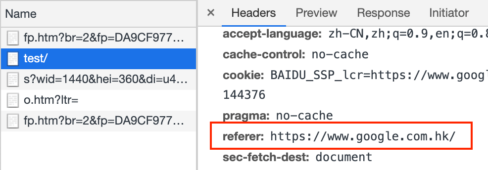

---
{
  "title": "防盗链时需要注意搜索引擎 Referer，百度和 Google 搜索内容跳转链接之间的区别",
  "staticFileName": "search_referer.html",
  "author": "guoqzuo",
  "createDate": "2020/12/15",
  "description": "一般搜索引擎为了方便网页做来源分析，不会使用 noreferer，因此从搜索引擎进入页面时，会携带对应的 Referer。当首页 index.html 也放在 CDN 的情况时，做防盗链 Referer 白名单时，要记得放开搜索引擎的相关 Referer。下面分两个部分介绍搜索引擎跳转链接的处理 1. 百度搜索结果链接的跳转方式 2. Google搜索结构链接的跳转方式",
  "keywords": "防盗链需要注意搜索引擎,百度和Google搜索跳转链接区别",
  "category": "http与https"
}
---
# 防盗链时需要注意搜索引擎 Referer，百度和 Google 搜索内容跳转链接之间的区别
一般搜索引擎为了方便网页做来源分析，不会使用 noreferer，因此从搜索引擎进入页面时，会携带对应的 Referer。当首页 index.html 也放在 CDN 的情况时，做防盗链 Referer 白名单时，要记得放开搜索引擎的相关 Referer。下面分两个部分介绍搜索引擎跳转链接的处理
1. 百度搜索结果链接的跳转方式
2. Google搜索结构链接的跳转方式


## 百度搜索结果链接的跳转方式

如上图所示，百度搜索结果列表里的链接，指向的任然是 baidu.com 的域名，访问这个链接它会做一个重定向。我们可以使用 `curl -v` 的方式来查看具体逻辑

```bash
curl -v 'https://www.baidu.com/link?url=MKActaa6Ed8aGU2yOX2y9v3ne5xinD6tt_v-PHOZ9STfd8cgtAY0yi-c5FEqiIt-CW9_8db1PBwqnTE7jEdb3K&wd=&eqid=a4d184060000714d000000065f9d3673'
```

下面是得到的网页内容


可以看到如果支持 `script`，一般默认使用 window.location.replace 重定向到目标链接。如果不支持 `script`，使用 meta 的方式进行跳转。

具体排版后，内容如下
```js
<script>
  try {
    if (window.opener && window.opener.bds && window.opener.bds.pdc && window.opener.bds.pdc.sendLinkLog) {
      window.opener.bds.pdc.sendLinkLog();
    }
  } catch (e) {
  };
  var timeout = 0;
  if (/bdlksmp/.test(window.location.href)) {
    var reg = /bdlksmp=([^=&]+)/, matches = window.location.href.match(reg);
    timeout = matches[1] ? matches[1] : 0
  };
  setTimeout(function () {
    window.location.replace("https://blog.csdn.net/aexwx/article/details/86775768")
  }, timeout);
  window.opener = null;
</script>
<noscript>
  <META http-equiv="refresh" content="0;URL='https://blog.csdn.net/aexwx/article/details/86775768'">
</noscript>
```
在进入下面后，我们查看 Network 里面的 Referer 会看到来源的百度链接，如下图


## Google搜索结构链接的跳转方式

如下图所示 Google 搜索列表是直接链接到目标地址，和百度先跳自己的链接再重定向是不同的。


这种情况来看进入页面后，其 Referer，可以看到只有 google 的链接没有参数，可能这就是为什么百度统计里面只能看到百度搜索的来源关键字，而看不到 Google 搜索的来源关键字的原因。

