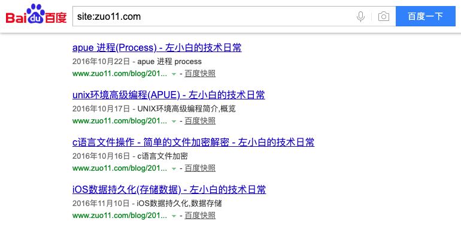
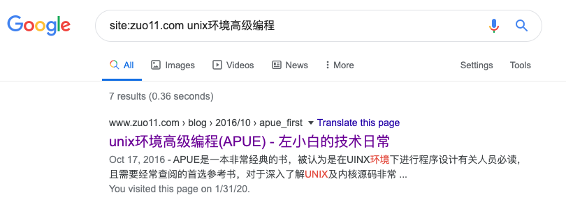

# description在seo中的重要性

网站页面描述(description)可能会直接显示在百度搜索的结果里，所以尽量不要写太少，不然看起来内容就比较少，description 最好能对当前页面的内容有一个大概的描述，下面我们来看看为什么会有这个结论。

## 网站页面描述(description)

2020年02月15号，我像往常一样在百度搜索 **site:zuo11.com** 来看网站的收录情况。发现之前在半个月前提交的页面，百度已经收录了部分。但仔细看发现有点怪，百度搜索出来的页面，内容显示的信息比较少，如下图：



而且这些信息正好是我通过 **meta** 元素指定的 **description** 属性的内容

```html
<meta name="application name" content="apue_first.html">
<meta name="author" content="guoqzuo">
<meta name="description" content="UNIX环境高级编程简介，概览">
<meta name="keywords" content="APUE,apue 笔记, APUE笔记,UNIX基础知识,UNIX环境高级编程,apue">
```

所以得出结论，在百度的搜索中，description的内容是很重要的，还是不能谁便填写。

## Google对description的处理
后面我看了下google的收录情况，发现同样的页面，google并不像百度那样直接显示description内容，而是直接截取了文章内容的开头部分，如下图:



## seo中Google和百度的一些区别
上面提到了Google在显示descrption时与百度的差异，其实还有有些地方有区别，比如收录页面规则，处理死链规则。

### 收录页面方面
- 百度: 先进行一段时间判定，页面评定OK后，会进行收录，提交一个页面，可能要半个月才会收录
- Google: 先进行收录，然后再一段时间内对页面进行判定，完成评估内容不好久会撤掉，提交一个页面，1天后就会收录

### 死链处理方面
- 百度: 当页面被收录，网站如果出现了改版，且收录的页面成了死链，提交死链给百度，3天后收录里面居然还有，处理的比较很慢
- Google: 提交死链后，最多一天你就在收录里看不到对应的死链页面了


注意：提交链接，提交死链需要在百度站长平台或Google Search console里提交

### 总结
相对于百度来讲google确实更智能一点


