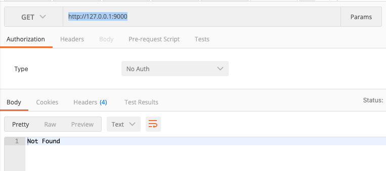

# koa ctx.body写在异步里接口会返回404的问题

在前端mock上传的接口时，发现总是404，刚开始以为是代理的问题，后来单独写了个demo，发现如果ctx.body放在异步的回调，后端接收到请求了，但还是会返回404，下面来具体研究下



```js
// 最简单的验证方法
setTimeout(() => {
  ctx.body = {} // 只要是异步，前端就会返回404
}, 0)
```

## 用koa写个简单的测试demo

demo如下，nodemon index.js后，我们用postman请求 `http://127.0.0.1:9000` 时，如果用setTimeout包裹，会返回404 Not Found，去掉setTimeout就可以正常返回 `{ msg: '成功'}`
```js
// index.js
const Koa = require('koa')
const app = new Koa()

app.use(ctx => {
  setTimeout(() => {
    ctx.body = {
      msg: '成功'
    }
  }, 0)
})

app.listen(9000, () => {
  console.log('server is start on 9000 port')
})
```

## 解决方法
在处理文件上传时，我们需要接收完所有文件数据后才响应结果给前端，接收上传肯定是一个异步操作，怎么解决这个问题呢？

**注意：不要把 ctx.body 写在异步操作里，异步操作封装成函数，调用时用await来等待，完成后再设置ctx.body**, 来看一个demo

```js
const Koa = require('koa')
const app = new Koa()

app.use(async ctx => {
    await asyncOpt()
    ctx.body = {
      msg: '成功'
    }
})

function asyncOpt() {
  return new Promise(r => setTimeout(()=> r(), 2000))
}

app.listen(9000, () => {
  console.log('server is start on 9000 port')
})
```

## 实际应用
上面的例子中，两秒后会返回结果。如果可以把异步操作像demo中那样封装，就没问题。所以对于接收上传文件，我们可以这样处理

```js
// 将文件数据接收，放到Promise里然后await，这样前端就不会404了
let data = await getUploadData(req)
ctx.body = {}

// 用 promise 封装一层
function getUploadData(req) {
  return new Promise((resolve, reject) => {
    let chunk = []
    let size = 0
    req.on('data', (data) => {
      console.log('data', data)
      chunk.push(data)
      size += data.length
    })

    req.on('end', () => {
      console.log('end')
      const data = Buffer.concat(chunk, size)
      resolve(data)
    })
  })
}
```