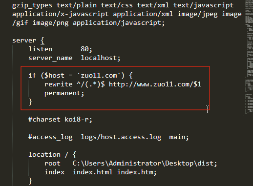

# nginx访问不带www的域名，自动切到www

在seo时，搜索引擎可能会将 `xx.com` 和 `www.xx.com` 一起收录。这里需要进行处理，当使用一级域名直接访问时(`xx.com`)，自动切到 `www.xx.com` ，下面来看看怎么配置nginx

```bash
# 修改nginx配置，加入如下转换
if ($host = 'zuo11.com') {
  rewrite ^/(.*)$ http://www.zuo11.com/$1 permanent;
}
```

如下图




测试是否生效
```bash
# 打开浏览器的console，测试是否有转换成功
location.host # zuo11.com 或 www.zuo11.com
```

参考：

- [nginx 域名跳转 Nginx跳转自动到带www域名规则配置、nginx多域名向主域名跳转](https://www.cnblogs.com/yiwd/p/3230371.html)

- [Converting rewrite rules - nginx](http://nginx.org/en/docs/http/converting_rewrite_rules.html)