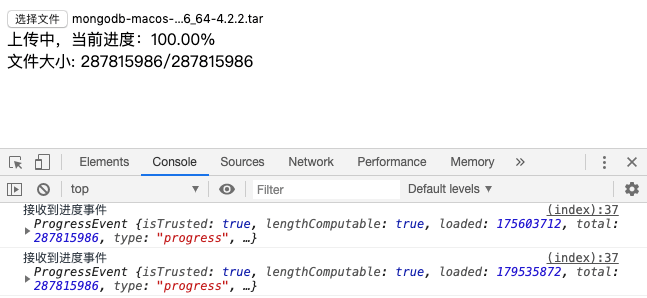

---
{
  "title": "前端怎么获取文件上传进度以及使用node mock上传文件接口demo",
  "staticFileName": "upload_progress_monitor.html",
  "author": "guoqzuo",
  "createDate": "2020/02/26",
  "description": "现在接口请求一般用的是axios，对于上传文件的进度监听，我们需要了解在axios的config参数里，可以传入onUploadProgress参数来接收upload进度事件，里面会有上传进度信息。我们前端怎么mock上传文件的接口呢？在koa处理时使用 `post-bodyparser` 可以很好的解析 `multipart/form-data` 数据，下面来具体看看",
  "keywords": "前端获取文件上传进度,文件上传进度demo,怎么获取文件上传进度,axios文件上传进度监听,前端怎么mock上传文件接口",
  "category": "http与https"
}
---

# 前端怎么获取文件上传进度以及使用node mock上传文件接口demo

现在接口请求一般用的是axios，对于上传文件的进度监听，我们需要了解在axios的config参数里，可以传入onUploadProgress参数来接收upload进度事件，里面会有上传进度信息。我们前端怎么mock上传文件的接口呢？在koa处理时使用 `post-bodyparser` 可以很好的解析 `multipart/form-data` 数据，下面来具体看看



## 前端demo
来看代码:

```html
<!-- 前端HTML -->
<body>
  <div>
    <input type="file" name="file" id="test">
    <div id="progressDiv"></div>
  </div>
  <script src="https://unpkg.com/axios/dist/axios.min.js"></script>
  <script>
    let fileInput = document.getElementById('test')
    let progressDiv = document.getElementById('progressDiv')

    // 当input文件输入框值改变时
    fileInput.onchange = () => {
      let file = fileInput.files[0]
      this.uploadFile(file)
    } 

    // 上传文件到后台
    async function uploadFile(file) {
      let fd = new FormData()
      fd.append('file', file)
      fd.append('type', 'mask')
      try {
        let payload = fd
        let res = await axios.post('/upload', payload, {
          // axios 接收进度事件文档
          // https://github.com/axios/axios#request-config
          onUploadProgress: function (progressEvent) {
            // {loaded: 1687552, total: 35353356, ...}
            console.log('接收到进度事件', progressEvent)
            progressDiv.innerHTML = `
              <div>上传中，当前进度：${((progressEvent.loaded / progressEvent.total) * 100).toFixed(2) }% </div> 
              <div>文件大小: ${progressEvent.loaded}/${progressEvent.total}
            `
          },
        })
        console.log(res)
      } catch(e) {
        cosnoel.error(e)
      }
    }
  </script>
</body>
```

## koa mock上传接口
koa后端接收处理 upload.js

```js
const Koa = require('koa')
const Router = require('koa-router')
const static = require('koa-static')
const BodyParser = require('post-bodyparser')

const router = new Router()
const app = new Koa()

app.use(static(__dirname + '/'))

router.post('/upload', async (ctx, next) => {
  console.log('upload', ctx.url)
  let { req } = ctx.request
  const parser =  new BodyParser(req);
  let body = await parser.formData()
  console.log(body)
  ctx.body = body
})

app.use(router.routes())

app.listen(3000)

// 打印内容
// upload
// /upload
// { file:
//    { value:
//       '/var/folders/mw/hbp6ytc9753gcm3zhqbmfkp40000gn/T/RAzvcR/9cd892b3-3243-4469-8cfa-ecbe2190a6ee.mongodb-macos-x86_64-4.2.2.tar',
//      name: 'file',
//      filename: 'mongodb-macos-x86_64-4.2.2.tar',
//      contentType: 'application/x-tar' },
//   type: 'mask' }
```

## 完整demo github地址
完整demo，参见: [upload文件上传demo - github](https://github.com/dev-zuo/fedemo/tree/master/src/DebugDemo/upload%E4%B8%8A%E4%BC%A0%E8%BF%9B%E5%BA%A6)