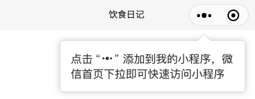

# 怎么给三角形加border，添加到我的小程序UI实现以及需要注意的问题

在给小程序添加 "添加到我的小程序" 引导时，里面有个带边框的三角形，如下图



一般用css画三角形使用的是border，但三角形边的边框怎么画呢？一般用两个三角形叠加来实现


```html
<view class="add-to-mymptips">
  <view class="atm-angle-a"></view>
  <view class="atm-angle-b"></view>
  <view class="atm-main">
    点击 <image src="/images/three_point.png"></image> 添加到我的小程序，微信首页下拉即可快速访问小程序
  </view>
</view>
```
来看css样式
```css
.add-to-mymptips {
  position: absolute;
  right: 15px;
  width: 270px;
  margin-top:15px;
  box-sizing: border-box;
}

/* 主内容区域 */
.atm-main {
  padding: 15px;
  border: 1px solid #ddd;
  border-radius: 5px;
  box-shadow: 0 0 10px #ccc;
  color:rgb(53, 53, 53);
}

/* 三个点图片样式 */
.atm-main image {
  width: 33px;
  height: 15px;
}

/* 三角形+边框 区域 */
.atm-angle-a, .atm-angle-b {
  position: absolute;
  margin-left:200px;
  width: 0;
  height: 0;
  border: 10px solid;
}
.atm-angle-a {
  top: -20px;
  border-color: transparent transparent #ccc;
}
.atm-angle-b {
  top:-19px;
  border-color: transparent transparent #fff;
}
```

参考：
- [纯CSS写三角形-border法](https://www.cnblogs.com/blosaa/p/3823695.html)


## 添加到我的小程序引导tips被原生组件遮挡的问题
在小程序里，为了增加用户留存，会做一个引导用户添加到我的小程序的提示面板

今天自己实现了下，发现原生组件遮挡了这个提示，貌似暂时没有很好的解决方法

所以，当设计小程序UI时，尽量不要在顶部使用原生组件。

参考：
- [原生组件相对层级 - 小程序](https://developers.weixin.qq.com/miniprogram/dev/component/native-component.html#%E5%8E%9F%E7%94%9F%E7%BB%84%E4%BB%B6%E7%9B%B8%E5%AF%B9%E5%B1%82%E7%BA%A7)