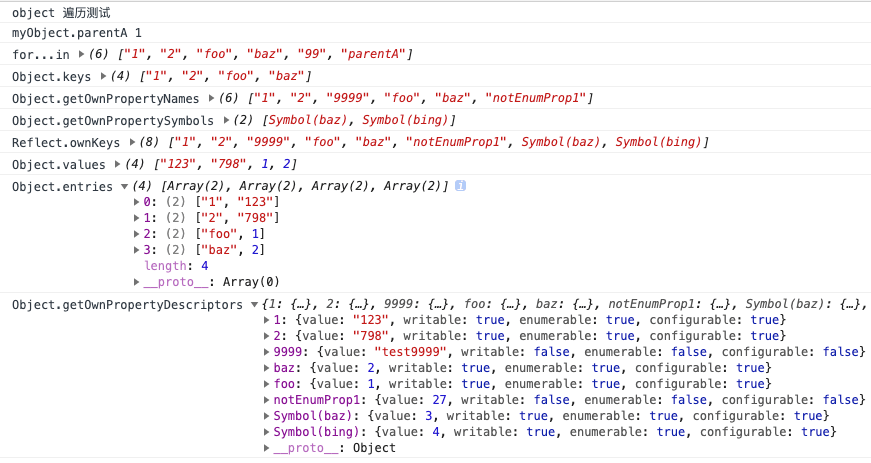

---
{
  "title": "深入JS遍历对象，从4个维度比较遍历对象的8种方法",
  "staticFileName": "js_obj_iterator.html",
  "author": "guoqzuo",
  "createDate": "2020/02/02",
  "description": "一般遍历对象时，大部分人可能想到的方法是for..in或Object.keys.forEach()，但你知道吗？截止ES2020，在JS中总共有8种方法来遍历对象，而且不同的遍历方法在一些细节方面会有区别，下面我们将从以下几个方面来深入理解JS遍历对象 1. 看似可以遍历对象但又不能遍历对象的for与for...of 2. 可能会对遍历对象产生影响的4种因素：属性是否可枚举、Symbol、是否有继承属性、遍历次序 3. 从ES5到ES2020发展过程中所有的可以遍历对象的方法 4. 通过实例demo来从4个维度比较8种遍历对象的方法 5. 属性遍历次序总结",
  "keywords": "js遍历对象,js遍历对象方法总结,js遍历对象的8种方法",
  "category": "JavaScript"
}
---

# 深入JS遍历对象，从4个维度比较遍历对象的8种方法

一般遍历对象时，大部分人可能想到的方法是for..in或Object.keys.forEach()，但你知道吗？截止ES2020，在JS中总共有8种方法来遍历对象，不同的遍历方法在一些细节方面会有区别，下面我们将从以下几个方面来深入理解JS遍历对象

1. 看似可以遍历对象但又不能遍历对象的for与for...of
2. 可能会对遍历对象产生影响的4种因素：属性是否可枚举、Symbol属性、继承属性、遍历次序
3. 从ES5到ES2020所有可以遍历对象的方法总结
4. 通过实例demo，从4个维度比较8种遍历对象方法
5. 属性遍历次序总结

**注意, 本文所指的对象是普通的键值对Object对象，而不是Array、Set等对象**

## for和for...of不能直接遍历Object对象
首先我们要知道for和for...of不能直接遍历Object对象，除非先将对象转换为数组或Set、Map等

下面对for...of的知识点做一些回顾，for...of可迭代的对象包括 Array，Map，Set，String，TypedArray，arguments 对象等等

JS有4种表示集合的数据结构
- ES5及之前: Array, Object
- ES6: Map, Set

Iterator 接口的目的，就是为所有数据结构，提供了一种统一的访问机制，即for...of循环。当使用for...of循环遍历某种数据结构时，该循环会自动去寻找 Iterator 接口。一种数据结构只要部署了 Iterator 接口，我们就称这种数据结构是“可遍历的”（iterable）。

ES6 规定，默认的 Iterator 接口部署在数据结构的Symbol.iterator属性，或者说，一个数据结构只要具有Symbol.iterator属性，就可以认为是“可遍历的”（iterable）。

### for...of遍历数组
```js
// 遍历数组 for...of
const arr = ['red', 'green', 'blue'];
for(let v of arr) {
  console.log(v); // red green blue
}
```

### for...of遍历Set和Map结构
```js
var engines = new Set(["Gecko", "Trident", "Webkit", "Webkit"]);
for (var e of engines) {
  console.log(e);
}
// Gecko
// Trident
// Webkit

var es6 = new Map();
es6.set("edition", 6);
es6.set("committee", "TC39");
es6.set("standard", "ECMA-262");
for (var [name, value] of es6) {
  console.log(name + ": " + value);
}
// edition: 6
// committee: TC39
// standard: ECMA-262

// example2
let map = new Map().set('a', 1).set('b', 2);
for (let pair of map) {
  console.log(pair);
}
// ['a', 1]
// ['b', 2]
for (let [key, value] of map) {
  console.log(key + ' : ' + value);
}
// a : 1
// b : 2
```

## 对象属性的可枚举属性
对象的每个属性都有一个描述对象（Descriptor），用来控制该属性的行为。Object.getOwnPropertyDescriptor方法可以获取该属性的描述对象。
```js
let obj = { foo: 123 };
Object.getOwnPropertyDescriptor(obj, 'foo')
//  {
//    value: 123,
//    writable: true,
//    enumerable: true,
//    configurable: true
//  }
```
目前，有六个操作会忽略enumerable为false的属性。
- for...in循环：只遍历对象自身的和继承的可枚举的属性。
- Object.keys()：返回对象自身的所有可枚举的属性的键名。
- Object.values()：返回对象自身的所有可枚举的属性的值。
- Object.entires()：返回对象自身的所有可枚举的属性的键值对。
- JSON.stringify()：只串行化对象自身的可枚举的属性。
- Object.assign()： 忽略enumerable为false的属性，只拷贝对象自身的可枚举的属性。

另外，ES6 规定，所有 Class 的原型的方法都是不可枚举的。总的来说，操作中引入继承的属性会让问题复杂化，大多数时候，我们只关心对象自身的属性。所以，尽量不要用for...in循环，而用Object.keys()代替。

## 对象Symbol属性名的遍历问题
Symbol 作为属性名，该属性不会出现在for...in、for...of循环中，也不会被Object.keys()、Object.getOwnPropertyNames()、JSON.stringify()返回。但是，它也不是私有属性，有一个Object.getOwnPropertySymbols方法，可以获取指定对象的所有 Symbol 属性名。
```js
let sym = Symbol('foo')
let obj = {a: 1, b:2, [sym]: 3}

Object.getOwnPropertyNames() // ["a", "b"]
Object.getOwnPropertySymbols(obj) // [Symbol(foo)]

// Reflect.ownKeys() 返回一个数组，包含对象自身的所有键名，不管键名是 Symbol 或字符串，也不管是否可枚举。
Reflect.ownKeys(obj) // ['a', 'b', Symbol(aaa)]
```

## ES6遍历对象的5种方法
ES6 一共有 5 种方法可以遍历对象的属性。

### for...in
for...in循环遍历对象自身的和继承的可枚举属性（不含 Symbol 属性）。

### Object.keys(obj)
Object.keys返回一个数组，包括对象自身的（不含继承的）所有可枚举属性（不含 Symbol 属性）的键名。

### Object.getOwnPropertyNames(obj)
Object.getOwnPropertyNames返回一个数组，包含对象自身的所有属性（不含 Symbol 属性，但是包括不可枚举属性）的键名。

### Object.getOwnPropertySymbols(obj)
Object.getOwnPropertySymbols返回一个数组，包含对象自身的所有 Symbol 属性的键名。包括不可枚举属性

### Reflect.ownKeys(obj)
Reflect.ownKeys返回一个数组，包含对象自身的所有键名，不管键名是 Symbol 或字符串，也不管是否可枚举。基本等同于Object.getOwnPropertyNames与Object.getOwnPropertySymbols之和。
```js
var myObject = {
  foo: 1,
  bar: 2,
  [Symbol.for('baz')]: 3,
  [Symbol.for('bing')]: 4
}
// 旧写法
Object.getOwnPropertyNames(myObject)
// ['foo', 'bar']
Object.getOwnPropertySymbols(myObject)
//[Symbol(baz), Symbol(bing)]
// 新写法
Reflect.ownKeys(myObject)
// ['foo', 'bar', Symbol(baz), Symbol(bing)]
```

## ES2017 新增3种遍历对象的方法
由于for...in可以遍历出继承自父元素的原型属性，导致一般可能不会用这个方法来遍历。所以在遍历对象时，一般比较优雅的方式是下面的方法
```js
Object.keys(myObj).forEach(function (key) {
  let obj = myObj[key];
  // do something with obj
});
```

但这种方法的缺陷是，我如果想操作对象里面的所有值，我需要先转数组再forEach，再通过key从对象里取值，会很麻烦。于是就有人提议是否可以把数组的Array.prototype.values()和entries()引入到Object来，这样操作对象就灵活了，于是就有了Object.values与Object.entries

以下是TC39关于Object.values/Object.entries 相关描述

> It is a very common use case to need the own values of an object - for example, when using an object as a hash filter. Many libraries have a “values” function: lodash/underscore, jQuery, Backbone, etc.

> It is also useful to obtain an array of key/value pairs (what the spec calls “entries”) from an object, for the purposes of iteration or serialization. With the advent of the Map constructor accepting an iterable of entries, and its associated entries iterator (WeakMap also accepts iterable entries in its constructor), it becomes very compelling to want to quickly convert a plain object to a Map, via passing an array of entries into new Map.

> We already have the precedent of Object.keys returning an array of own keys, and matched triplets of keys/values/entries iterators on Map/Set/Array. As such, per discussions on es-discuss and in at least one previous TC39 meeting, this proposal seeks to add Object.values and Object.entries to ECMAScript. Like Object.keys, they would return arrays. Their ordering would match Object.keys ordering precisely, such that the indices of all three resulting arrays would reflect the same key, value, or entry on the object.

### Object.values与Object.entries
他们和Object.keys返回的都一样是**数组**，除了下面的for...of遍历外，我们也可以使用forEach
```js
// import { keys, values, entries } from '@dict';
let { keys, values, entries } = Object;

let obj = { a: 1, b: 2, c: 3 };

for (let key of keys(obj)) {
// ['a', 'b', 'c']
}

for (let value of values(obj)) {
// [1, 2, 3]
}

for (let [key, value] of entries(obj)) {
// [['a', 1], ['b', 2], ['c', 3]]
}
```

### 地表最强Object.getOwnPropertyDescriptors()
ES5 的Object.getOwnPropertyDescriptor()方法会返回某个对象属性的描述对象（descriptor）。ES2017 引入了Object.getOwnPropertyDescriptors()方法，返回指定对象所有自身属性（非继承属性）的描述对象。

```js
// 1.获取属性的描述对象 Object.getOwnPropertyDescriptor()
Object.getOwnPropertyDescriptor(book, "_year"); 
// {"value":2004,"writable":false,"enumerable":false,"configurable":false}

// 2.获取对象的所有自身属性表述对象
const obj = {
  foo: 123,
  get bar() { return 'abc' }
};

Object.getOwnPropertyDescriptors(obj)
// { foo:
//    { value: 123,
//      writable: true,
//      enumerable: true,
//      configurable: true },
//   bar:
//    { get: [Function: get bar],
//      set: undefined,
//      enumerable: true,
//      configurable: true } }
```
**该方法的引入目的，主要是为了解决Object.assign()无法正确拷贝get属性和set属性的问题。这是因为Object.assign方法总是拷贝一个属性的值，而不会拷贝它背后的赋值方法或取值方法。这时，Object.getOwnPropertyDescriptors()方法配合Object.defineProperties()方法，就可以实现正确拷贝。**
```js
// 1.Object.assign()无法拷贝set,get方法
const source = {
  set foo(value) {
    console.log(value);
  }
};

const target1 = {};
Object.assign(target1, source);

Object.getOwnPropertyDescriptor(target1, 'foo')
// { value: undefined,
//   writable: true,
//   enumerable: true,
//   configurable: true }

// 2.Object.getOwnPropertyDescriptors()方法配合Object.defineProperties()方法
const source = {
  set foo(value) {
    console.log(value);
  }
};

const target2 = {};
Object.defineProperties(target2, Object.getOwnPropertyDescriptors(source));
Object.getOwnPropertyDescriptor(target2, 'foo')
// { get: undefined,
//   set: [Function: set foo],
//   enumerable: true,
//   configurable: true }
```
Object.getOwnPropertyDescriptors()方法可以实现一个对象继承另一个对象。
```js
// 写法1
const obj = {
  __proto__: prot,
  foo: 123,
};

// 写法2
const obj = Object.create(prot);
obj.foo = 123;

// 写法3
const obj = Object.assign(
  Object.create(prot),
  {
    foo: 123,
  }
);

// 写法4
const obj = Object.create(
  prot,
  Object.getOwnPropertyDescriptors({
    foo: 123,
  })
);
// Object.create(proto[, propertiesObject])  NDN
// https://developer.mozilla.org/zh-CN/docs/Web/JavaScript/Reference/Global_Objects/Object/create
```

## 从4个维度比较遍历对象8种方法
我们通过一个demo从4个维度来比较8种遍历对象方法的异同点​

1. 是否可以遍历不可枚举属性
2. 是否可以遍历Symbol属性
3. 是否可以遍历继承的原型属性
4. 遍历次序

```js
console.log('object 遍历测试')

// 1. 安排 继承属性
function A() {
  this['99'] =  2,
  this.parentA = '1'
}
let a = new A()
// 原型继承，只是将a的原型属性挂载到了myObject上
let myObject = Object.create(a)
// 测试继承来的原型属性 
console.log('myObject.parentA', myObject.parentA)

// 2. 安排各种常规属性、symbol属性，数值属性
Object.assign(myObject, {
  foo: 1,
  baz: 2,
  "2": "798",
  "1": "123",
  [Symbol.for('baz')]: 3,
  [Symbol.for('bing')]: 4
})

// 3. 安排两个不可枚举属性
Object.defineProperties(myObject, {
  notEnumProp1: { 
    configurable: false,
    enumerable: false,
    writable: false,
    value: 27
  },
  '9999': {
    enumerable: false,
    value: "test9999"
  }
})

// 4. 测试
let forInArr = []
for (let item in myObject) {
  forInArr.push(item)
}
console.log('for...in', forInArr)
console.log('Object.keys', Object.keys(myObject))
console.log('Object.getOwnPropertyNames', Object.getOwnPropertyNames(myObject))
console.log('Object.getOwnPropertySymbols', Object.getOwnPropertySymbols(myObject))
console.log('Reflect.ownKeys', Reflect.ownKeys(myObject))
console.log('Object.values', Object.values(myObject))
console.log('Object.entries', Object.entries(myObject))
console.log('Object.getOwnPropertyDescriptors', Object.getOwnPropertyDescriptors(myObject))
// 未实现的
// console.log('Reflect.ownValues', Reflect.ownValues(myObject)) // 仅在tc39文档里讨论过
// console.log('Reflect.ownEntries', Reflect.ownEntries(myObject)) // 仅在tc39文档里讨论过
```

运行结果如下图，完整demo可以从 [github](https://github.com/zuoxiaobai/fedemo/blob/master/src/DebugDemo/JS%E9%81%8D%E5%8E%86%E5%AF%B9%E8%B1%A1%E7%9A%848%E4%B8%AD%E6%96%B9%E6%B3%95%E5%AF%B9%E6%AF%94/test.js) 下载



综上，他们遍历次序基本一致，我们只需要比较三个维度即可，如下表

遍历方法 | 可以遍历不可枚举属性 | 可以遍历Symbol属性 | 可以遍历继承的原型属性
---|---|---|---
for...in | 否 | 否 | 是
Object.keys() | 否 | 否|否
Object.values() |否|否|否
Object.entries() | 否 |否|否
Object.getOwnPropertyNames() |是|否|否
Object.getOwnPropertySymbols() | 是 |是|否
Reflect.ownKeys()|是|是|否
Object.getOwnPropertyDescriptors() | 是|是|否


## 8种遍历方法遵循同一次序规则
以上的 8 种方法遍历对象的键名，都遵守同样的属性遍历的次序规则。
- **首先遍历所有数值键，按照数值升序排列。**
- 其次遍历所有字符串键，**按照加入时间升序排列**。
- 最后遍历所有 Symbol 键，**按照加入时间升序排列**。
- 如果是for...in，最后遍历继承自父元素的原型属性，按照先数值、再字符串的顺序

总结：当如果同时存在数值属性、字符串属性等时，for...in遍历属性是无序的。如需确定顺序，建议使用数组。

## 参考
- [tc39/proposals finished-proposals](https://github.com/tc39/proposals/blob/master/finished-proposals.md)
- [tc39/proposal-object-values-entries](https://github.com/tc39/proposal-object-values-entries)
- [Iterator和for...of循环 | es6入门笔记](https://www.yuque.com/guoqzuo/js_es6/wnn0h0#8c8efbbe)
- [Reflect.ownKeys() | es6入门笔记](https://www.yuque.com/guoqzuo/js_es6/csk2et#85b97dce)
- [对象的扩展 | es6入门笔记](https://www.yuque.com/guoqzuo/js_es6/rxu7ms#358d8be2)
- [for...in - JavaScript | MDN](https://developer.mozilla.org/zh-CN/docs/Web/JavaScript/Reference/Statements/for...in)
- [for...in遍历的顺序](https://blog.csdn.net/SailingLee/article/details/84598921)