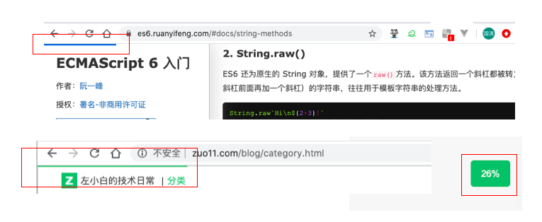

---
{
  "title": "JS怎么监听当前页面滚动比例，完整UI实现demo",
  "staticFileName": "js_scorll_percent.html",
  "author": "guoqzuo",
  "createDate": "2020/03/02",
  "description": "在阮一峰的es6入门教程里，顶部有一个计算页面百分比的UI，于是就想尝试实现这个功能，恰好在js高程3里有对应的描述，来看看",
  "keywords": "页面滚动比例监听",
  "category": "JavaScript"
}
---

# JS怎么监听当前页面滚动比例，完整UI实现demo

在阮一峰的es6入门教程里，顶部有一个计算页面百分比的UI，于是就想尝试实现这个功能，恰好在js高程3里有对应的描述，来看看



监听页面的scroll事件，整个滚动距离为 document.documentElement.scrollHeight - window.innerHeight，当前scrollTop除以整个滚动距离，就是页面的百分比，向body挂载两个div来显示进度信息

完整demo
```js
// 页面滚动比例监听
// posTop 顶部类似阮一峰ES6网页的滚动进度条
// pos 右下角滚动百分比
// JS高程3 - UI事件 scroll事件
// https://www.yuque.com/guoqzuo/js_es6/elgng1#e38771e5
let htmlStr = `
  <div id="posTop" style="position: fixed;top:0;height:2px;background: #25b864;z-index:999999;"></div>
  <div id="pos" style="display:none;position:fixed;bottom: 100px;right:20px;padding:10px;background: #25b864;color:white;width:40px;text-align: center;border-radius:5px;"></div>
`
let eleNode = document.createElement('div')
eleNode.innerHTML = htmlStr
document.body.appendChild(eleNode)

window.addEventListener('scroll', function(e) {
  let scrollTop = document.documentElement.scrollTop;
  let total = document.documentElement.scrollHeight - window.innerHeight;
  let persentage = parseInt(scrollTop/total*100);
  // console.log(scrollTop);  

  document.getElementById('pos').style.display = scrollTop === 0 ? 'none' : 'block';
  document.getElementById('pos').innerHTML = `${persentage}%`;
  document.getElementById('posTop').style.width = `${persentage}%`;
}, false)
```