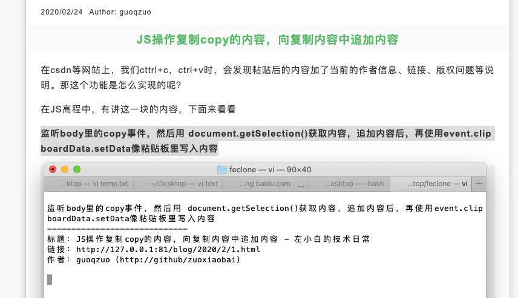

---
{
  "title": "JS操作复制copy的内容，向复制内容中追加内容",
  "staticFileName": "js_copy_opt.html",
  "author": "guoqzuo",
  "createDate": "2020/03/02",
  "description": "在csdn等网站上，我们cttrl+c，ctrl+v时，会发现粘贴后的内容加了当前的作者信息、链接、版权问题等说明。那这个功能是怎么实现的呢？在JS高程中，有讲这一块的内容，下面来看看",
  "keywords": "js操作粘贴板内容,js向copy的内容中追加信息,js向复制信息里追加内容",
  "category": "JavaScript"
}
---

# JS操作复制copy的内容，向复制内容中追加内容

在csdn等网站上，我们cttrl+c，ctrl+v时，会发现粘贴后的内容加了当前的作者信息、链接、版权问题等说明。那这个功能是怎么实现的呢？



在JS高程中，有讲这一块的内容，下面来看看

**监听body里的copy事件，然后用 document.getSelection()获取内容，追加内容后，再使用event.clipboardData.setData像粘贴板里写入内容**

```js
// 操作粘贴板
// JS高程3 表单脚本 操作粘贴板
// https://www.yuque.com/guoqzuo/js_es6/ubpn7k#8482e7c5
document.body.oncopy = function(event) {
  console.log('copy', event);
  // 获取copy的内容
  // console.log(document.getSelection().toString());
  // 在copy内容里加入信息
  var msg = `
-----------------------------
标题：${document.title}
链接：${location.href}
作者：guoqzuo (http://github/zuoxiaobai)
  `
  event.clipboardData.setData('text/plain', `${document.getSelection().toString()} ${msg}`);
  event.preventDefault();
};
```