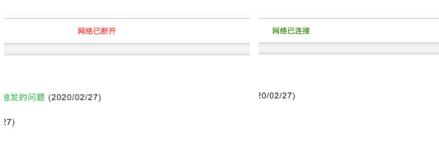

# 网页中怎么实时监听网络变动并给出提示

在js高程3中有讲过一个内容，叫做离线检测，就是监听页面的online和offline事件，这样在断网或再次连接到网络时，就会有对应的提示，下面是zuo11.com使用的网络检测功能，可以参考下



```js
// 当网络状态发生改变时（有网 => 无网，无网 => 有网）,提示信息
// JS高程3 离线检测
// 参考: https://www.yuque.com/guoqzuo/js_es6/sp2k81#244d3090
let errorMsgNode // 用来移除错误信息节点
window.ononline = function(event) {
  errorMsgNode && document.body.removeChild(errorMsgNode)
  message('success', '网络已连接', 3000)
}
window.onoffline = function(event) {
  message('error', '网络已断开')
}
/**
 * 为了显示网络信息，专门写了个小tips提示函数，在顶部显示信息
 * @param {}} type 文字颜色 error 为红色，其他为绿色
 * @param {*} msg 显示信息
 * @param {*} sec 如果有传入时间，sec秒后关闭提示
 */
function message(type, msg, sec) {
  let color = type === 'error' ? 'red' : 'green'
  let cssArr = [
    'position:fixed;top:8px;left:50%;z-index:9999999;',
    'transform:translateX(-50%);padding:5px 10px;background:#fff;'
  ]
  let htmlStr = `
    <div style="${cssArr.join('')}color:${color}">${msg}</di>
  `
  let node = document.createElement('div')
  node.innerHTML = htmlStr
  document.body.appendChild(node)
  if (Number.isInteger(sec) && sec > 0) {
    setTimeout(() => {
      document.body.removeChild(node)
    }, sec)
  } else {
    // 错误信息，一直提示，需要设置到变量里，等网络连接上时移除
    errorMsgNode = node
  }
}
```