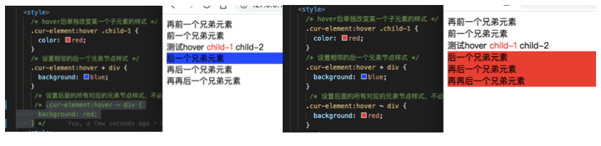

---
{
  "title": "css hover后改变其他元素样式",
  "staticFileName": "css_hover.html",
  "author": "guoqzuo",
  "createDate": "2020/06/29",
  "description": "css中某个元素hover后，可以对其他元素设置样式，但注意：只限定于改变他的子元素, 以及其后面的元素，下面我们写demo来看看",
  "keywords": "css hover后改变其他元素样式,css 元素hover后设置其他元素样式",
  "category": "CSS"
}
---

# css hover后改变其他元素样式

css中某个元素hover后，可以对其他元素设置样式，但注意：只限定于改变他的子元素, 以及其后面的元素，下面我们写demo来看看



```html
<style>
  /* hover后单独改变某一个子元素的样式 */
  .cur-element:hover .child-1 {
    color: red;
  }
  /* 设置相邻的后一个兄弟节点样式 */
  .cur-element:hover + div {
    background: blue;
  }
  /* 设置后面的所有对应的兄弟节点样式，不必相邻，但需要再其后面 */
  .cur-element:hover ~ div {
    background: red;
  }
</style>
<div class="parent">
  <div>再前一个兄弟元素</div>
  <div>前一个兄弟元素</div>
  <div class="cur-element">
    测试hover
    <span class="child-1">child-1</span>
    <span class="child-2">child-2</span>
  </div>
  <div>后一个兄弟元素</div>
  <div>再后一个兄弟元素</div>
  <div>再再后一个兄弟元素</div>
</div>
```

完整demo参见: [css hover后改变其他样式demo | github](https://github.com/dev-zuo/fedemo/blob/master/src/DebugDemo/hover%E6%94%B9%E5%8F%98%E5%85%B6%E4%BB%96%E5%85%83%E7%B4%A0%E6%A0%B7%E5%BC%8F/index.html)