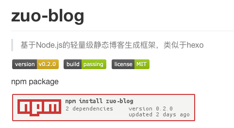

# github tag标签图片以及npm badge图片生成

在github写readme时，最开始一般会贴一些tab标签(徽章图片)，比如 build passing，license MIT 等，注意这些都是引入的图片，npm badge也是类似的情况下面来看看



## github tab标签图片
```js
// 上图对应的三个徽章图片
 
 
 
// 发现规律没，更改后面的参数，就可以生成不同的图片

// 比如
https://img.shields.io/badge/JAVA-1.8+-green.svg
```

## npm 徽章图片
主要适用于npm包，显示npm包的一些信息，只要把你npm包名替换掉对应的包名就可以了

```js
// 文档 https://www.npmjs.com/package/npm-badge
// zuo-blog npm包使用示例，只需要把对应的npm 包名称修改即可

//   
[](https://npmjs.org/package/zuo-blog)
```