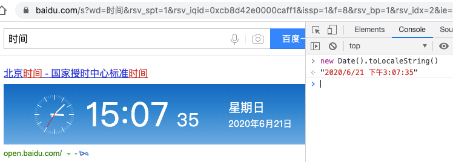
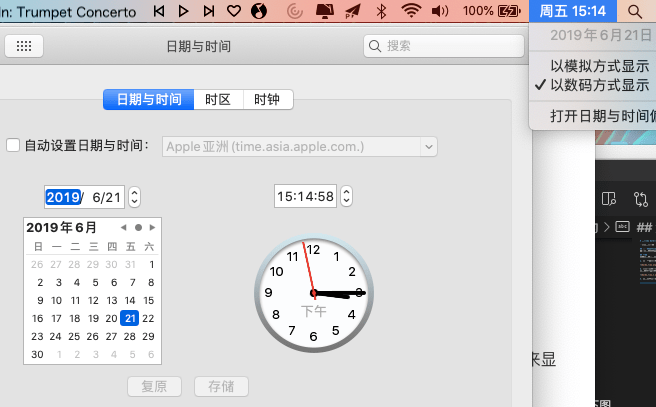
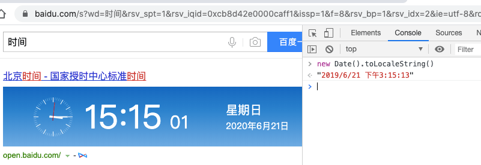

# 使用new Date()在前端获取当期时间是不准确的

一般我们在前端开发中，经常会用到new Date()来获取当前时间，但我们要知道：new Date()是获取的当前操作系统的时间，它是不准确的？

## 为什么不准确呢？
因为我们知道电脑的时间是可以自己修改的。当我们修改了电脑上的时间，再用new Date()获取时间就是修改后的时间，而不是当前时间。

## 测试
下面我们来进行具体的测试

### 1.打开百度，搜索 "时间"
这样我们就可以看到当前的时间了，如下图

### 2.打开console，打印new Date()的值
在当前网页中，按下F12或者右键 - 查看，进入浏览器的 console，使用 new Date().toLocaleString() 来显示当前时间，如下图，我们可以看到，正常情况下，用new Date()获取当前时间，是准确的。

### 3.修改系统时间
我们修改当前的时间为2019年，如下图

### 4.再次打印new Date()的值
修改时间后，我们再在console里打印 new Date().toLocaleString() 试试，我们发现这时候用new Date()获取的时间就不准确了，如下图

## 总结
通过上面的例子，我们可以发现前端获取时间是不准确的。**因此，一般获取当前时间是后端来处理的，比如在发送信息时，记录当前信息的发送时间，一般是后端来记录**

思考：后端来记录就没问题了吗？其实如果服务器系统的系统变更后，获取的时间也是不准确的。但一般不会有这个问题。就算有问题，这也不是前端的问题了，后端应该有一套机制来处理时间的问题。