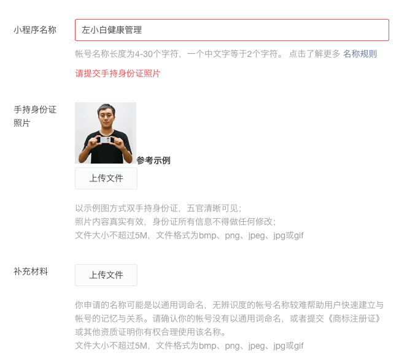
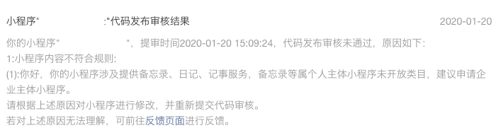
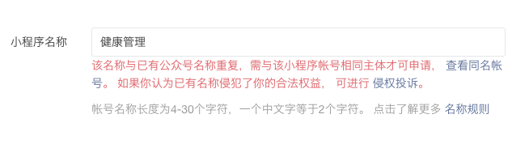
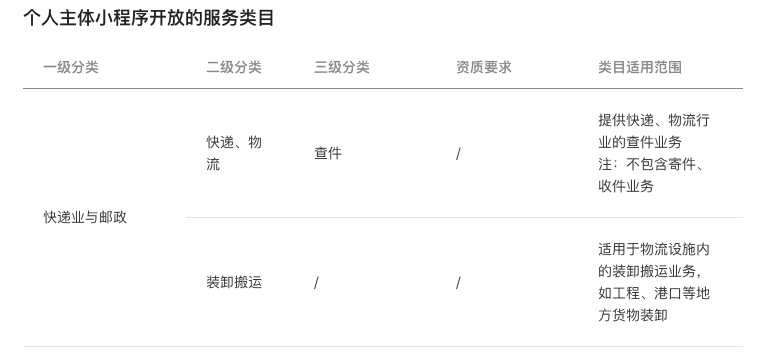

# 开发个人微信小程序前必看，个人主体可以做什么内容

微信小程序很早就已经开放个人主体了，也就是说个人开发者也可以上传、发布自己的小程序。但现在个人主体的小程序可以做的内容越来越少了，相信很多开发者都遇到过这种情况：好不容易做好的小程序，在准备上线时，由于类目问题，提交审核被拒，导致小程序无法上线的情况。

## 微信小程序现状
在19年我做小程序的时候，日记类的小程序个人还是可以做的，审核不会被拒，而且小程序名称也没有太多限制，现在这些都变了。

### 小程序名称的设置变的更加严格
现在稍微通用一点的关键字，比如包含 "管理" 两个字，可能会要求你提供上传手持身份证的照片，而且还要有对应的商标证书。如下图：

我搜索了下商标的问题，商标申请需要1000，且审批时间需要1年多... 对个人开发者来说，太难了

### 个人小程序容易被拒
只要名称中带有日记、记事方面的都会被拒绝，如下图

## 为什么会有这种情况呢？
之所以会变严格，我的理解是
1. 小程序名称问题：由于每个小程序名称是唯一的，早期存在乱取名，抢注小程序名称的情况。可以想象，之前应该发生了很多次涉及小程序名称侵权被用户投诉的案列，所以，微信官方才会加强小程序名称的审核

2. 个人小程序不能提供备忘录、日记、记事服务：这一块应该是涉及隐私问题，如果不限制，那么个人开发者可以轻易的获取的他人的隐私，对微信平台来讲会有风险。

## 那个人小程序可以做什么内容呢？
我们可以在小程序官方文档，运营 => 开放的服务类目 => [个人主体小程序](https://developers.weixin.qq.com/miniprogram/product/material/#个人主体小程序开放的服务类目) 查看个人主体的小程序可以做什么内容

如上图所示，官方已经列出了个人小程序可以开发的内容，**有些小程序个人主体是有资质要求的，需要提供一些许可证才行。因此，我们在开发个人主体的小程序时，一定要先看这个文档，查询下自己想要做的内容能不能做，是否有这个资质，不然做了也白做，审核会被拒绝，无法上线**

