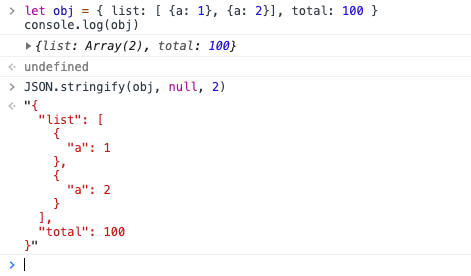

# JSON.stringify的非常规用法以及内部执行顺序
JSON.stringify我们一般用于将JSON对象转为字符串，但他不仅仅只有一个参数，而是三个，除最常用的用法外，还可以用来做三种实用功能: 1.利用第三参数在console里更好的展示对象; 2.有选择性的过滤字段; 3.详细处理没有字段序列化的值

## 利用第三参数在console里更好的展示对象

```js
// 1. 对于像这种多层级的数据，console到控制台时，会不好查看需要一层层点击，很麻烦
let obj = { list: [ {a: 1}, {a: 2}], total: 100 }
console.log(obj)

// 更好的展现，第三参数可以在转JSON字符串时，在json对象的缩进位置填充字符并加上换行符
// 缩进位置填充的内容，根据第三参数的类型决定：
// 如果是整数，填充对应的空格数(最大为10)，如果是字符串，填充充对应的字符串
JSON.stringify(obj, null, 2) 
```



## 有选择性的过滤字段

```js
let obj = { list: [ {a: 1}, {a: 2} ], total: 100 }
// 如果我们想深拷贝obj，但只深拷贝其total字段，其他的字段不需要，就可以用第二个参数
let newObj = JSON.parse(JSON.stringify(obj, ['total']))
// newObj 值为 { total: 100 }

// 实例：在vue项目中，用js删除当前url query参数中的id参数
let query = this.$route.query
this.$router.replace({ 
  path: this.$route.path, 
  query: JSON.parse(JSON.stringify(query, Object.keys(query).filter(item => item !== 'id'))) 
})
```

## 详细处理每个字段序列化的值

```js
let obj = { list: [ {a: 1}, {a: 2} ], total: 100 }
let new = JSON.stringify(obj, (key, value) => {
  return key === 'list' ? '改写list序列化的值' : value
}) 
// new 的值为 {"list":"改写list序列化的值","total":100}
```

JSON.stringify(obj)时，其实内部调用的是 obj 的 toJSON()方法，如果我们重写该方法，就可以改变序列化后返回的值

## JSON.stringify()执行顺序
1. 如果对象中存在toJSON方法，且能通过它获取有效的值，则调用该方法，返回对应的值用于下一步，否则返回对象本身。
2. 如果提供了第二个参数，根据对应的参数过滤第(1)步得到的值
3. 对第(2)步返回的每个值进行进行相应的序列化
4. 如果提供了第三个参数，执行相应的格式化

详情参考之前的笔记: [JSON.stringify() - JS高程3笔记](https://www.yuque.com/guoqzuo/js_es6/strtxi#8960b7f6)
