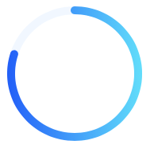

---
{
  "title": "canvas怎么绘制环形进度条",
  "staticFileName": "canvas_progress.html",
  "author": "guoqzuo",
  "createDate": "2020/07/12",
  "description": "使用canvas绘制渐变的环形进度条，主要是使用arc函数，下面来看看。4个重点：1. 怎么画圆弧, ctx.arc函数里开始角度、结束角度以PI为基准，取值范围时：0 ~ 2PI，PI就是π值约等于3.14，圆心正上方位置为1.5PI，圆心右侧为 0 或 2*PI，圆心正下方为0.5PI，选定义额开始位置和结束位置就可以绘制任意一个弧形",
  "keywords": "canvas绘制环形进度条,js画环形渐变进度条,canvas画进度条",
  "category": "JavaScript"
}
---

# canvas怎么绘制环形进度条

使用canvas绘制渐变的环形进度条，主要是使用arc函数，下面来看看

## 4个重点
1. 怎么画圆弧, ctx.arc函数里开始角度、结束角度以PI为基准，取值范围时：0 ~ 2PI，PI就是π值约等于3.14，圆心正上方位置为1.5PI，圆心右侧为 0 或 2*PI，圆心正下方为0.5PI，选定义额开始位置和结束位置就可以绘制任意一个弧形，详情参见: [之前的canvas笔记 - 绘制路径](https://www.yuque.com/guoqzuo/js_es6/sbx6vi#eda54f70)

2. 画圆环使用的是ctx.stroke，一般默认画圆大概是1px的宽度，线的宽度可以使用 **ctx.lineWidth** 调整，这样就成圆环了

3. 用ctx.arc画一个完整的圆，再画一个进度圆弧，重叠在一起，颜色设置不一样，就是一个标准的圆环进度条了。

4. 进度圆环怎么设置圆角，可以使用 ctx.lineCap = "round";

5. 关于retina两倍屏，需要注意乘以设备像素比，参见：[canvas绘制模糊的问题](http://www.zuo11.com/blog/2020/7/canvas_dim.html)



## 简单代码实现
完整demo可以参见github：[渐变环形进度条 | github](https://github.com/zuoxiaobai/fedemo/blob/master/src/DebugDemo/%E6%B8%90%E5%8F%98%E7%8E%AF%E5%BD%A2%E8%BF%9B%E5%BA%A6%E6%9D%A1/index.html)
```html
<canvas id="drawing" width="180" height="180" >A draw of something.</canvas>
<script>
  let drawing = document.getElementById('drawing');
  let ctx = drawing.getContext('2d');
  let percent = 80 // 进度百分比
  let circleRadios = 80 // 圆环半径
  let lineWidth = 10
  let PI = 3.1415926
  let long  = (percent / 100) * PI * 2 // 百分比进度条长度
  let start = 1.5 * PI // 圆心正上方位置是 1.5PI
  ctx.lineWidth = lineWidth

  // 背景圆环
  let x = circleRadios + lineWidth
  let y = x
  ctx.beginPath()
  ctx.strokeStyle = 'rgb(241,247,255)'
  ctx.arc(x, y, circleRadios, start + long, start)
  ctx.stroke()

  // 进度圆环
  ctx.beginPath()
  let gradient = ctx.createLinearGradient(circleRadios * 2 + lineWidth * 2, lineWidth + circleRadios, 0 , circleRadios + lineWidth); // 从(130,130)到(160,160)渐变
  gradient.addColorStop(0, '#64E1FA'); // 渐变的起点色
  gradient.addColorStop(1, '#215BF7'); // 渐变的结束色
  ctx.strokeStyle = gradient
  ctx.arc(x, y, circleRadios, start, start + long)
  ctx.lineCap = "round";
  ctx.stroke()
</script>
```

## 参考 
- [用初中数学知识撸一个canvas环形进度条](https://juejin.im/post/5dc626125188253aec025a60#heading-10)
- [用canvas画一个进度条为圆角的环形图（圆环图）](https://www.jianshu.com/p/e0fe05210134)
