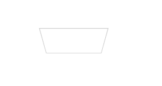

---
{
  "title": "css利用perspective画梯形",
  "staticFileName": "css_perspective.html",
  "author": "guoqzuo",
  "createDate": "2020/07/26",
  "description": "今天看小伙伴的代码，发现有一个梯形的实现居然是css写的，我以为需要UI提供icon。这里用到了 perspective 远景这个参数",
  "keywords": "css画梯形,css perspective",
  "category": "CSS"
}
---
# css利用perspective画梯形

今天看小伙伴的代码，发现有一个梯形的实现居然是css写的，我以为需要UI提供icon。这里用到了 perspective 远景这个参数



```css
/*  <div class="tx"></div> */
.tx {
  width: 100px;
  height: 40px;
  margin: 100px;
  border: 1px solid #ccc;
  transform: perspective(2em) rotateX(-10deg);
}
```

CSS 属性 perspective指定了观察者与 z=0 平面的距离，使具有三维位置变换的元素产生透视效果。 z>0 的三维元素比正常大，而 z<0 时则比正常小，大小程度由该属性的值决定。

参考: 
- [css perspective | MDN](https://developer.mozilla.org/zh-CN/docs/Web/CSS/perspective)
- [css transfrom | MDN](https://developer.mozilla.org/zh-CN/docs/Web/CSS/transform)
