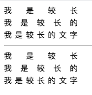

---
{
  "title": "text-align: justify两端对齐不生效的问题",
  "staticFileName": "text-align.html",
  "author": "guoqzuo",
  "createDate": "2020/07/26",
  "description": "一般直接设置text-align: justify是不会生效的。但你改为text又会立即居中对齐。我们需要注意的是我们需要将子元素设置一个after的属性或者后面放置一个空的占位标签，设置 display: inline-block; width: 100%，当出现高度占位间隙时，设置占位元素的height没用，需要设置元素的height。css 确实有点毫无逻辑的感觉....",
  "keywords": "text-align:justify,text-align:justify不生效的问题",
  "category": "CSS"
}
---
# text-align: justify 两端对齐不生效的问题
一般直接设置text-align: justify是不会生效的。但你改为text又会立即居中对齐。我们需要注意的是我们需要将子元素设置一个after的属性或者后面放置一个空的占位标签，设置 display: inline-block; width: 100%，当出现高度占位间隙时，设置占位元素的height没用，需要设置元素的height。css 确实有点毫无逻辑的感觉....



```html
<head>
  <style>
    .sec,
    .sec2 {
      width: 150px;
      text-align: justify;
    }

    /* fix 占位元素高度问题 */
    .sec>div,
    .sec2>div {
      height: 25px;
      line-height: 25px;
    }

    .zw {
      display: inline-block;
      width: 100%
    }

    .sec2>div::after {
      content: '';
      display: inline-block;
      width: 100%;
      overflow: hidden;
      height: 0;
    }
  </style>
</head>

<body>
  <div class="sec">
    <div>
      我是较长<p class="zw"></p>
    </div>
    <div>
      我是较长的<p class="zw"></p>
    </div>
    <div>
      我是较长的文字<p class="zw"></p>
    </div>
  </div>
  <hr>
  <div class="sec2">
    <div>我是较长</div>
    <div>我是较长的</div>
    <div>我是较长的文字</div>
  </div>
</body>
```

参考：[使用text-align:justify，让内容两端对齐，兼容IE及主流浏览器的方法](https://blog.csdn.net/qq_29608143/article/details/83625318)
