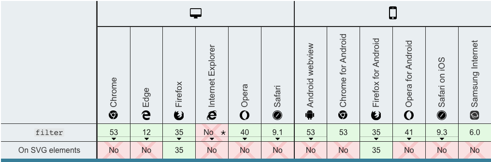

---
{
  "title": "全国哀悼日，怎么用一行css代码将整个站点变灰",
  "staticFileName": "css_filter_gray.html",
  "author": "guoqzuo",
  "createDate": "2020/07/12",
  "description": "前天4月4号全国哀悼日，各大网公司网站的风格都变灰了，是怎么实现的呢？其实很简单，一行代码就搞定。filter: grayscale(100%); css filter是什么属性？用css filter mdn关键字查了下，这里filter翻译为 滤镜，他可以将模糊或色相等图形效果应用于元素，来看一些例子",
  "keywords": "css滤镜,css filter,怎么用一行css代码将整个站点变灰,怎么将站点置灰",
  "category": "CSS"
}
---

# 全国哀悼日，怎么用一行css代码将整个站点变灰

前天4月4号全国哀悼日，各大网公司网站的风格都变灰了，是怎么实现的呢？其实很简单，一行代码就搞定。

```css
/* 将html下的所有内容置灰 grayscale为灰度 */
html {
  filter: grayscale(100%);
}
```

css filter是什么属性？用css filter mdn关键字查了下，这里filter翻译为 **滤镜**，**他可以将模糊或色相等图形效果应用于元素**，来看一些例子

```css
/* 模糊，类似于马赛克效果 */
filter: blur(5px); 
/* 对比度 */
filter: contrast(100%);
/* 色相 */
filter: hue-rotate(90deg);
/* 阴影 */
filter: drop-shadow(16px 16px 20px red) invert(75%);
```

兼容性除了IE4-9，其他基本都兼容。Internet Explorer 4 to 9 implemented a non-standard filter property. The syntax was completely different from this one.





更多filter文档及用法，参考：[css filter - MDN](https://developer.mozilla.org/zh-CN/docs/Web/CSS/filter)