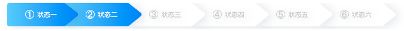

---
{
  "title": "实战canvas绘制不规则形状填充渐变色",
  "staticFileName": "cavas_unnormal_shape.html",
  "author": "guoqzuo",
  "createDate": "2020/07/06",
  "description": "在JS高程3中，有一章专门将使用canvas绘图，今天终于用上了，效果还不错，来看效果，原生js，70行不到，用canvas画不规则形状，且添加渐变色",
  "keywords": "实战canvas绘制不规则形状填充渐变色,canvas画不规则形状,canvas渐变",
  "category": "JavaScript"
}
---
# 实战canvas绘制不规则形状填充渐变色

在JS高程3中，有一章专门将使用canvas绘图，今天终于用上了，效果还不错，来看效果，原生js，70行不到，用canvas画不规则形状，且添加渐变色



```js
<canvas id="drawing1" width="720" height="45" >A draw of something.</canvas>
<script>
  drawStatus('drawing1', 2)
  function drawStatus(domId, position) {
    let str = ['① 状态一', '② 状态二', '③ 状态三', '④ 状态四', '⑤ 状态五', '⑥ 状态六']
    let config = {
      width: 100,
      height: 40,
      extendLength: 20,
      radius: 4
    }
    let config2 = { ...config, width: 110 }
    let cur = str.length - position

    str.reverse().forEach((item, index) => {
      let pos = str.length - index - 1
      let x = 0 + (str.length - 1) * config.radius
      if (pos !== 0) {
        x = (pos * 100) + (pos -1) * 10 + (str.length - 1 - pos) * config.radius
      }
      console.log(pos,x)
      let curConfig = pos === 0 ? config : config2 
      if (pos < (str.length - cur)) {
        curConfig.isFocus = true
      }
      drawUnnormalShape(domId, x , 0, str[index], curConfig)
    })
  }

  function drawUnnormalShape(domId, x, y, text, config) {
    let drawing = document.getElementById(domId);
    let ctx = drawing.getContext('2d');
    let { width, height, extendLength, radius, isFocus } = config 
    ctx.beginPath(); // 如果都需要重新beginPath 不然，后面的fill会覆盖前面的fill
  
    // 不规则矩形
    ctx.moveTo(x + radius, y) // 从左上角 (x + radius, y) 位置开始
    ctx.arcTo(x, y, x, y + radius, radius) // 左上圆角
    ctx.lineTo(x, y + height - 2 * radius) // 画左边
    ctx.arcTo(x, y + height, x + radius, y + height, radius) // 左下圆角
    ctx.lineTo(x + width - radius, y + height) // 下边
    // ctx.arcTo(x + width - radius, y + height, x + width - radius, y + height - 1, 1) // 圆角

    let extendEndX = x + width + extendLength
    let middleHeight = y + height / 2
    ctx.arcTo(extendEndX, middleHeight, extendEndX - radius, middleHeight - radius, radius) // 线 + 圆角
    ctx.lineTo(x + width - radius, y)
    ctx.lineTo(x + radius, y)

    var gradient = ctx.createLinearGradient(x, y + height / 2, x + width + extendLength, y + height / 2); // 从(130,130)到(160,160)渐变
    gradient.addColorStop(0, isFocus ? '#62ccff' : '#fff'); // 渐变的起点色
    gradient.addColorStop(1, isFocus ? '#0486fe' : '#fff'); // 渐变的结束色

    ctx.shadowOffsetX = 6;
    ctx.shadowOffsetY = 2;
    ctx.shadowBlur = 16; // 模糊像素
    ctx.shadowColor = "rgba(58, 86, 111, 0.15)";

    ctx.fillStyle = gradient
    ctx.fill() // ctx.stroke()

    let textArr = text.split(' ')
    ctx.font = "15px arial"
    ctx.fillStyle = isFocus ? '#fff' : '#ccc'
    ctx.fillText(textArr[0], x + width / 2 - 20, y + height / 2 + 5)
    ctx.font = "11px arial"
    ctx.fillText(textArr[1], x + width / 2, y + height / 2 + 4)
  }
</script>
```

参考之前的笔记：[使用canvas绘图 - JS高程3笔记](https://www.yuque.com/guoqzuo/js_es6/sbx6vi#a59e2f96)

完整demo: [canvas画不规则形状填充渐变背景 - github](https://github.com/zuoxiaobai/fedemo/blob/master/src/DebugDemo/canvas画不规则形状填充渐变背景/index.html)