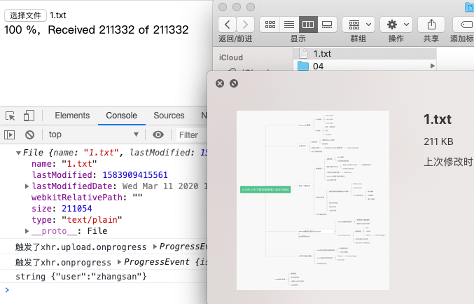

---
{
  "title": "根据文件名后缀判断文件类型不准确，那怎么判断两个文件一模一样呢",
  "staticFileName": "file_same.html",
  "author": "guoqzuo",
  "createDate": "2020/07/06",
  "description": "一般根据文件名后缀判断文件类型不准确，比如我有个1.png文件，我修改下后缀名 1.txt，那前端如果仅凭文件名的后缀来显然是不行的，我们需要根据文件类型的二进制数据标记来判断对应的文件类型，这样才会更加准确，安全性更高",
  "keywords": "怎么判断两个文件一样,文件一致性检验,根据文件名后缀判断文件类型是不准确的",
  "category": "计算机基础与开发工具"
}
---

# 根据文件名后缀判断文件类型不准确，那怎么判断两个文件一模一样呢

一般根据文件名后缀判断文件类型不准确，比如我有个1.png文件，我修改下后缀名 1.txt，那前端如果仅凭文件名的后缀来显然是不行的，我们需要根据文件类型的二进制数据标记来判断对应的文件类型，这样才会更加准确，安全性更高

## 怎么判断两个文件一模一样呢
一般文件的md5可能会有重复的，怎么减少这种概率呢？校验分三个部分
1. 比较整个文件的md5
1. 选择文件固定位置的几个片段分别计算md5进行比对
2. 比较文件名是否一样