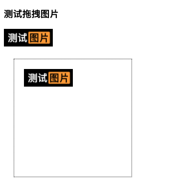
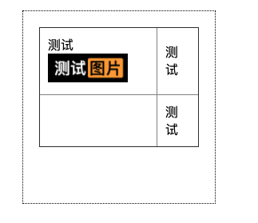

# H5原生拖放(Drag and Drop)demo以及浏览器兼容性处理

一般在网页中，如果需要实现拖放，首先要有两个元素
1. 可拖动的元素，元素draggable="true"属性就是可拖放，如果设置为false就是不可拖放
2. 可以放置的区域，注意chrome如果不将放置区域的onenter和onover事件阻止默认行为，无法触发drop函数



## 拖放的过程中的钩子
1. 拖动元素时，会触发元素的 dragstart 钩子函数，在函数里可以设置数据、以及拖动到放置区域的鼠标样式
2. 当拖动元素进入放置区域时，放置区域元素会触发一次dragenter钩子(拖动进入)，触发多次dragover(拖动元素在放置区域移动中)，放下时再触发放置元素的drop钩子，这里可以用来接收拖拽元素dragstart设置的data，处理拖动的行为

## 注意事项：浏览器兼容性处理

1. 在Chrome中，放置区域的ondrop事件不触发，需要在onenter和onover事件里阻止默认行为（火狐不需要这样处理）

2. event.dataTransfer.effectAllowed只能设置鼠标样式，不能设置拖动元素行为，drag后之前的元素会消失，想要保留需要使用cloneNode来操作
  
```js
// 放置后，删除原来的图片
// ev.target.appendChild(document.querySelector(`#${reciveData}`))
// 放置后，保留原图片
ev.target.appendChild(document.querySelector(`#${reciveData}`).cloneNode(true))
```

3. 在Firefox（火狐）浏览器里drop图片后，会新在新的tab也打开图片，不仅要在drop里阻止默认行为，还要阻止事件冒泡

## demo实例
demo如下，demo [在线体验地址](https://zuoxiaobai.github.io/fedemo/src/DebugDemo/%E6%8B%96%E5%8A%A8%E5%9B%BE%E7%89%87demo/)，demo [github源码](https://github.com/zuoxiaobai/fedemo/blob/master/src/DebugDemo/%E6%8B%96%E5%8A%A8%E5%9B%BE%E7%89%87demo/index.html)



```html
<!-- 图片默认的 draggable="true" 而想 h1这种默认为false不可拖动 -->

<!-- 放置区域a -->
<div class="wrap" id="targetA"></div>

<script>
// 被拖动元素的事件监听
let img = document.getElementById('img')
// 当元素开始拖动时触发，仅触发一次
img.addEventListener('dragstart', (ev) => {
  // 设置值，在放置区域触发drop事件时，可以通过ev.dataTransfer.getData获取这里的值
  ev.dataTransfer.setData("text", ev.target.id)
  // link 会影响拖动到放置区域的鼠标样式，只是样式，并不决定行为 
  ev.dataTransfer.effectAllowed = 'copy'; 
})

// 放置区域A的事件监听
let targetA = document.getElementById('targetA')
// 当有拖动元素(放到)落到放置区域时触发，一次
targetA.addEventListener('drop', (ev) => {
  ev.stopPropagation(); // 必要，阻止冒泡，防止火狐浏览器放置图片后打开新的窗口
  ev.preventDefault(); // 必要，阻止默认行为 防止火狐浏览器放置后直接打开图片

  // 放置落下时，接收被拖拽的元素在 dragstart时用ev.dataTransfer.setData设置的值
  // 这里传的id备用
  let reciveData = ev.dataTransfer.getData("text")
  console.log('drop, recive data', reciveData, ev.dataTransfer.dropEffect)

  // 必要，设置拖动后放置的效果，移动还是copy
  // 放置后，删除原来的图片
  // ev.target.appendChild(document.querySelector(`#${reciveData}`))
  // 放置后，保留原图片
  ev.target.appendChild(document.querySelector(`#${reciveData}`).cloneNode(true))

  ev.target.classList.remove('active') // 必要，放置在区域里后，还原样式
})

// 当拖动元素移动到放置区域时触发，触发多次
targetA.addEventListener('dragover', (ev) => {
  ev.preventDefault() // 必要，chrome drop兼容必须
})
// 当拖动元素进入放置区域时触发，一次
targetA.addEventListener('dragenter', (ev) => {
  ev.preventDefault() // 必要，chrome drop兼容必须
  ev.target.classList.add('active') // 必要，设置进入时的样式
})
  // 当拖动元素离开放置区域时触发，一次
targetA.addEventListener('dragleave', (ev) => {
  ev.target.classList.remove('active') // 必要，设置离开后的样式
})
</script>
```

## 参考资料文档

- [HTML 拖放 API - Web API 接口参考 | MDN](https://developer.mozilla.org/zh-CN/docs/Web/API/HTML_Drag_and_Drop_API)
- [dataTransfer.setData无效，drop不触发的问题](https://segmentfault.com/q/1010000011761601/)
- [火狐drop后会打开新tab的问题](https://www.cnblogs.com/liulei-cherry/p/8440609.html)
- [js 拖动后,怎么保持原来的元素不消失，drop后拖动元素消失的问题](https://zhidao.baidu.com/question/1449513599728916460.html)
- [cloneNode | JS高程3笔记](https://www.yuque.com/guoqzuo/js_es6/hoglme)

扩展：

- [从电脑拖放文件到浏览器，读取拖拽文件并上传 | JS高程3笔记](https://www.yuque.com/guoqzuo/js_es6/nocthb#bdcc30d7)
- [非H5原生拖放实现拖放 | JS高程3笔记](https://www.yuque.com/guoqzuo/js_es6/aquxsq#eeddf2fd)
