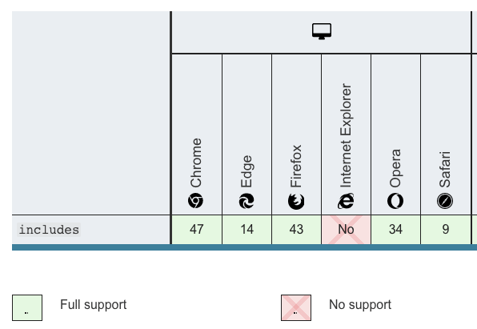

# Symbol和Array.prototype.includes不兼容IE，有babel就可以，他的原理是什么

在mdn上可以查相关API的兼容性,可以看到Symbol和Array.prototype.includes是不支持IE的，但我们在vue-cli的项目中，发现使用了这些api，在IE下也可以运行，这是为什么呢？

主要是安装了babel，babel有进行转换，当IE不支持某个方法时，会使用替代的pollyfill，那它是怎么打包进项目的？



## 什么是babel？
为什么会有babel，babel出现的原因是JS的一些很好的新特性在一些低浏览器版本或者IE下无法使用。为了用最新的JS语法特性写的代码在某些不兼容的环境下也可以正常运行，babel应运而生。

> Babel is a JavaScript compiler，Babel is a toolchain that is mainly used to convert ECMAScript 2015+ code into a backwards compatible version of JavaScript in current and older browsers or environments. Here are the main things Babel can do for you:

babel是一个js编译器，他是一个工具链(toolchain)，它主要用于将 ES6(ES2015)+ 的代码转换为在低版本浏览器或执行环境可以跑起来的代码。他主要做了以下事情：

1. Transform syntax(语法转换)
2. Polyfill features that are missing in your target environment (through @babel/polyfill) (当浏览器会运行环境不支持某些API时，通过使用@babel/polyfill补充上对应的API实现内容(polyfill features))
3. Source coude transformations（codemods） 源码转换
4. And more！（check out these videos for inspiration）（更多，查看这些[视频](https://babeljs.io/videos.html)以获取灵感）

```js
// Babel Input: ES2015 arrow function
[1, 2, 3].map((n) => n + 1);

// Babel Output: ES5 equivalent
[1, 2, 3].map(function(n) {
  return n + 1;
});
```

## 关于@babel/polyfill与core-js
一般polyfill只会提供es2015+相关的内容，且当某些新特性还没到 Stage 4 proposals(第4阶段的提议)之前，是不支持的

As of Babel 7.4.0, this package has been deprecated in favor of directly including core-js/stable (to polyfill ECMAScript features) and regenerator-runtime/runtime (needed to use transpiled generator functions):

在 Babel 7.4.0 中，@babel/polyfill这个包被废弃了，现在由 [`core-js/stable`](https://github.com/zloirock/core-js) 来polyfill features
```js
import "core-js/stable";
import "regenerator-runtime/runtime";
```

参考 [@babel/polyfill](https://babeljs.io/docs/en/babel-polyfill#tc39-proposals)

我们在core-js的源码中找找 symbol 和includes的实现，一般源码目录在 core-js/internals 目录下，下面是 include polyfill的实现
```js
// /core-js/internals/array-includes.js
var toIndexedObject = require('../internals/to-indexed-object');
var toLength = require('../internals/to-length');
var toAbsoluteIndex = require('../internals/to-absolute-index');

// `Array.prototype.{ indexOf, includes }` methods implementation
var createMethod = function (IS_INCLUDES) {
  return function ($this, el, fromIndex) {
    var O = toIndexedObject($this);
    var length = toLength(O.length);
    var index = toAbsoluteIndex(fromIndex, length);
    var value;
    // Array#includes uses SameValueZero equality algorithm
    // eslint-disable-next-line no-self-compare
    if (IS_INCLUDES && el != el) while (length > index) {
      value = O[index++];
      // eslint-disable-next-line no-self-compare
      if (value != value) return true;  // ??????
    // Array#indexOf ignores holes, Array#includes - not
    } else for (;length > index; index++) {
      if ((IS_INCLUDES || index in O) && O[index] === el) return IS_INCLUDES || index || 0;
    } return !IS_INCLUDES && -1;
  };
};

module.exports = {
  // `Array.prototype.includes` method
  // https://tc39.github.io/ecma262/#sec-array.prototype.includes
  includes: createMethod(true),
  // `Array.prototype.indexOf` method
  // https://tc39.github.io/ecma262/#sec-array.prototype.indexof
  indexOf: createMethod(false)
};
```

tc39官网介绍：When the includes method is called, the following steps are taken:

```js
// https://tc39.github.io/ecma262/#sec-array.prototype.includes
1. Let O be ? ToObject(this value).
2. Let len be ? LengthOfArrayLike(O).
3. If len is 0, return false.
4. Let n be ? ToInteger(fromIndex).
5. Assert: If fromIndex is undefined, then n is 0.
6. If n ≥ 0, then
     Let k be n.
   Else,
     Let k be len + n.
     If k < 0, set k to 0.
8. Repeat, while k < len,
     Let elementK be the result of ? Get(O, ! ToString(k)).
     If SameValueZero(searchElement, elementK) is true, return true.
     Set k to k + 1.
9. Return false.
```

关于 sameValueZero算法，参见 [samevaluezero tc39](https://tc39.es/ecma262/#sec-samevaluezero)

## symbol polyfill实现
```js
// `Symbol.prototype.description` getter
// https://tc39.github.io/ecma262/#sec-symbol.prototype.description
// /core-js/modules/es.symbol.description.js
var NativeSymbol = global.Symbol;

if (DESCRIPTORS && typeof NativeSymbol == 'function' && (!('description' in NativeSymbol.prototype) ||
  // Safari 12 bug
  NativeSymbol().description !== undefined
)) {
  var EmptyStringDescriptionStore = {};
  // wrap Symbol constructor for correct work with undefined description
  var SymbolWrapper = function Symbol() {
    var description = arguments.length < 1 || arguments[0] === undefined ? undefined : String(arguments[0]);
    var result = this instanceof SymbolWrapper
      ? new NativeSymbol(description)
      // in Edge 13, String(Symbol(undefined)) === 'Symbol(undefined)'
      : description === undefined ? NativeSymbol() : NativeSymbol(description);
    if (description === '') EmptyStringDescriptionStore[result] = true;
    return result;
  };
  copyConstructorProperties(SymbolWrapper, NativeSymbol);
  var symbolPrototype = SymbolWrapper.prototype = NativeSymbol.prototype;
  symbolPrototype.constructor = SymbolWrapper;

  var symbolToString = symbolPrototype.toString;
  var native = String(NativeSymbol('test')) == 'Symbol(test)';
  var regexp = /^Symbol\((.*)\)[^)]+$/;
  defineProperty(symbolPrototype, 'description', {
    configurable: true,
    get: function description() {
      var symbol = isObject(this) ? this.valueOf() : this;
      var string = symbolToString.call(symbol);
      if (has(EmptyStringDescriptionStore, symbol)) return '';
      var desc = native ? string.slice(7, -1) : string.replace(regexp, '$1');
      return desc === '' ? undefined : desc;
    }
  });
```

## babel是怎么自动打包进vue-cli项目里的
在babel github官方仓库里面有一个 `babel-loader` 项目，主要是Babel loader for webpack，另外vue-cli的package.json里也引入了 `@vue/cli-plugin-babel`，后面有时间再深入研究

