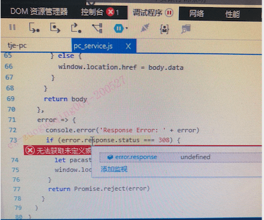

# pinyin中文转拼音npm包在前端使用时的坑,IE下js错误调试方法

在很早之前node项目中就使用过这个npm包。这次由于Element table组件排序时，无法按照首字母排序，就引入了这个包。由于是单页面应用，import进来是没问题的，chrome里面正常。

```js
import pinyin from "pinyin";

console.log(
  pinyin("测试", {
    style: pinyin.STYLE_NORMAL, // 设置拼音风格
    heteronym: true
  }).join("") 
);
// ceshi
```

后面在IE11里出现了一个bug，就是页面路由不能正常加载，调了好久。最开始以为是路由层级的问题，调到怀疑人生，最后发现是 pinyin 这个包的问题，他在IE下无法正常加载，偶尔报错 "函数错误"，导致整个页面执行失败，路由无法加载。**所以在遇到难调试的问题时，先把error的报错全部解决再调**, 已经遇到好几次这种情况了

## IE下调试js错误的方法

IE下出现异常，console里是无法看到是哪个文件报错的，需要在F12里点击断点位置，选择遇到错误时停止，这样出现问题就会自动跳转到对应的位置

