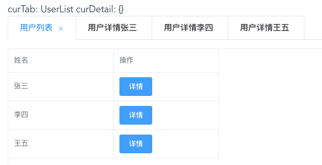

---
{
  "title": "vue + element实现在用户列表页同时打开多个用户详情页tab功能",
  "staticFileName": "sameCompSwtich.html",
  "author": "guoqzuo",
  "createDate": "2020/08/30",
  "description": "在使用el-tabs时，如果涉及到同组件会打开多个tab的情况，同组件切换需要使用watch来监听数据改变，再进行数据的初始化。下面结合一个实例来看看，使用 vue + elementUI 实现在用户列表页同时打开多个用户详情页tab功能",
  "keywords": "vue element el-tabs标签页功能demo",
  "category": "Vue"
}
---
# vue + element实现在用户列表页同时打开多个用户详情页tab功能

在使用el-tabs时，如果涉及到同组件会打开多个tab的情况，同组件切换需要使用watch来监听数据改变，再进行数据的初始化

下面结合一个实例来看看，使用 vue + elementUI 实现在用户列表页同时打开多个用户详情页tab功能



目录结果如下

```bash
sameCompTabs
├── comps
│   ├── UserDetail.vue # 用户详情组件
│   └── UserList.vue # 用户列表组件
└── index.vue # 入口页，el-tabs页面
```

## tabs入口页
index.vue
```html
<template>
  <div class="same-comp-tabs">
    curTab: {{ curTab }} curDetail: {{ curUserDetail }}

    <el-tabs v-model="curTab" type="card" closable @tab-remove="tabRemove">
      <el-tab-pane
        v-for="item in tabList"
        :key="item.name"
        :label="item.title"
        :name="item.name"
      >
      </el-tab-pane>
    </el-tabs>

    <keep-alive>
      <component
        :is="curComp"
        :detail="curUserDetail"
        @open-detail="openDetail"
      ></component>
    </keep-alive>
  </div>
</template>

<script>
export default {
  components: {
    UserList: () => import("./comps/UserList"),
    UserDetail: () => import("./comps/UserDetail")
  },

  computed: {
    curComp() {
      return this.curTab.split("|")[0];
    },
    curUserDetail() {
      for (let i = 0, len = this.tabList.length; i < len; i++) {
        let item = this.tabList[i];
        // console.log("item", item);
        if (item.name === this.curTab && item.name.includes("UserDetail")) {
          return item.detail;
        }
      }
      return {};
    }
  },

  data() {
    return {
      curTab: "UserList", // v-model的值为el-tab-pane name值
      tabList: [
        {
          title: "用户列表",
          name: "UserList"
        }
      ]
    };
  },

  methods: {
    openDetail(detail) {
      console.log("open detail in index.vue", JSON.stringify(detail));

      let name = `UserDetail|${detail.id}`;
      this.curTab = name;

      // 之前打开过
      if (this.tabList.some(item => item.name === name)) {
        return;
      }

      this.tabList.push({
        title: "用户详情" + detail.name,
        name,
        detail
      });
    },

    tabRemove(name) {
      console.log("remove name", name);
      if (["UserList"].includes(name)) {
        return;
      }
      this.tabList = this.tabList.filter(item => item.name !== name);
      this.curTab = "UserList";
    }
  }
};
</script>

<style lang="less" scoped>
.same-comp-tabs {
  padding: 20px;
}
</style>

```

## 用户列表组件 
UserList.vue

```html
<template>
  <div>
    <el-table
      :data="tableData"
      size="small"
      height="250"
      border
      style="width: 100%"
    >
      <el-table-column prop="name" label="姓名" width="180"></el-table-column>
      <el-table-column label="操作" width="180">
        <template v-slot:default="scope">
          <el-button type="primary" size="small" @click="openDetail(scope.row)">
            详情
          </el-button>
        </template>
      </el-table-column>
    </el-table>
  </div>
</template>

<script>
export default {
  data() {
    return {
      tableData: [
        { name: "张三", id: "zhangsan" },
        { name: "李四", id: "lisi" },
        { name: "王五", id: "wangwu" }
      ]
    };
  },
  methods: {
    openDetail(detail) {
      console.log(JSON.stringify(detail, null, 2));
      this.$emit("open-detail", detail);
    }
  }
};
</script>

<style></style>

```
## 用户详情组件
UserDetail.vue
```html
<template>
  <!-- 用户详情页 -->
  <div>
    <h1>用户详情页</h1>
    <div>userId: {{ detail.id }} userDetail: {{ userDetail }}</div>
  </div>
</template>

<script>
export default {
  props: ["detail"],

  data() {
    return {
      userDetail: {}
    };
  },

  created() {
    console.log("create");
    this.getDetailById();
  },

  methods: {
    getDetailById() {
      console.log("get detail by id", this.detail.id);
      this.userDetail = {
        id: this.detail.id
      };
    }
  },

  // 同组件之间的切换
  watch: {
    detail: {
      handler: function(val, oldVal) {
        console.log(
          "detail change",
          JSON.stringify(val),
          JSON.stringify(oldVal)
        );
        this.getDetailById();
      },
      deep: true
    }
  }
};
</script>

<style></style>

```

完整demo地址：[用户列表打开多个用户详情demo | github](https://github.com/dev-zuo/fedemo/tree/master/src/vuecli-demo/src/views/sameCompTabs)

