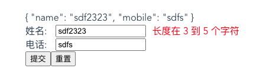

# vue element表单组件简单实现
在写表单时，一般我们会用到el-form相关组件，那它内部是怎么实现的呢？下面我们来写个demo，尝试实现下。



## 测试组件demo
先来写一个调用示例，把el-前缀换成z-，然后我们需要实现z-form, z-form-item, z-input组件
```html
<template>
  <!-- /elementForm -->
  <div>
    <z-form ref="ruleForm" v-model="form" :rules="rules">
      {{ form }}
      <z-form-item label="姓名" prop="name">
        <z-input v-model="form.name" placeholder="请输入姓名"></z-input>
      </z-form-item>
      <z-form-item label="电话" prop="mobile">
        <z-input v-model="form.mobile" placeholder="请输入电话"></z-input>
      </z-form-item>
      <button @click="submitForm('ruleForm')">提交</button>
      <button @click="resetForm('ruleForm')">重置</button>
    </z-form>
  </div>
</template>

<script>
export default {
  components: {
    ZInput: () => import("./ZInput"),
    ZFormItem: () => import("./ZFormItem"),
    ZForm: () => import("./ZForm")
  },
  data() {
    return {
      form: {
        name: "",
        mobile: ""
      },
      rules: {
        name: [
          { required: true, message: "请输入姓名", trigger: "blur" },
          { min: 3, max: 5, message: "长度在 3 到 5 个字符", trigger: "blur" }
        ],
        mobile: [{ required: true, message: "请输入电话", trigger: "change" }]
      }
    };
  },
  methods: {
    submitForm(formName) {
      this.$refs[formName].validate(valid => {
        console.log("valid", valid);
        if (valid) {
          alert("submit!");
        } else {
          console.log("error submit!!");
        }
      });
    },
    resetForm(formName) {
      this.$refs[formName].resetFields();
    }
  }
};
</script>
```

## 表单组件的封装 
z-form, z-form-item, z-input

### ZInput.vue
1. 双向绑定:@input、:value 派发校验事件
2. 派发校验事件

```html
<template>
  <div>
    <!-- 
      1. <z-input v-model="searchForm.name"></z-input> 等价于
      <z-input :value="searchForm.name" @input="searchForm.name = $event"></z-input>
      虽然等价，区别是什么呢？v-model在输入法组合过程中不会更新值，而@input这种是会更新的，详情参见之前的笔记
      2. v-bind="$attrs" 接收z-input上的除props接收外设置的其它属性，比如placeholder等
    -->
    <input :value="value" @input="oninput" v-bind="$attrs" />
  </div>
</template>

<script>
export default {
  props: {
    value: {
      type: String,
      required: true
    }
  },
  methods: {
    oninput(e) {
      this.$emit("input", e.target.value); // 双向绑定
      this.$parent.$emit("validate"); // 触发父组件的校验
    }
  }
};
</script>
```

### ZFormItem.vue
1. 给Input预留插槽 
2. slot 能够展示label和校验信息
3. 能够进行校验

```html
<template>
  <div class="z-form-item">
    <div class="label">{{ label }}:</div>
    <div class="input"><slot></slot></div>
    <div class="error" v-if="errMsg">{{ errMsg }}</div>
  </div>
</template>

<script>
import Schema from "async-validator";
export default {
  inject: ["form"], // 从祖先组件接收searchForm传参
  props: {
    label: {
      // 对应的标签名
      type: String,
      required: true,
      default: ""
    },
    prop: {
      // 对应的字段名
      type: String
    }
  },

  data() {
    return {
      errMsg: "" // 错误信息
    };
  },

  mounted() {
    // 当前组件监听validate事件，子组件通过$parent.$emit触发
    this.$on("validate", () => {
      this.validate();
    });
  },

  methods: {
    // 返回promise, 注意 asyc-validator的版本，需要是新的
    validate() {
      let value = this.form.model[this.prop];
      let rules = this.form.rules[this.prop];
      console.log(this.prop, value, rules);

      let desc = { [this.prop]: rules };
      let schema = new Schema(desc);
      return schema.validate({ [this.prop]: value }, errors => {
        if (errors) {
          this.errMsg = errors[0].message;
        } else {
          console.log("验证成功");
          this.errMsg = "";
        }
      });
    },
    //  rules: {
    //     name: [
    //       { required: true, message: "请输入姓名", trigger: "blur" },
    //       { min: 3, max: 5, message: "长度在 3 到 5 个字符", trigger: "blur" }
    //     ],
    //     mobile: [{ required: true, message: "请输入电话", trigger: "change" }]
    //   }
    resetFields() {
      this.form.model[this.prop] = ""; // 重置值
      this.errMsg = ""; // 重置错误消息
    }
  }
};
</script>
```

### ZForm.vue
1. 给FormItem留插槽 
2. 设置数据和校验规则 
3. 全局校验

```html
<template>
  <!-- el-form 模拟-->
  <div>
    <slot></slot>
  </div>
</template>

<script>
export default {
  // 将z-form元素上的model以及rules属性的值传递到z-form-item，用于校验，显示错误信息
  provide() {
    return {
      form: {
        model: this.value,
        rules: this.rules
      }
    };
  },
  props: {
    value: {
      type: Object
    },
    rules: {
      type: Object
    }
  },
  methods: {
    // submit时的校验
    async validate(cb) {
      // this.$children 所有form-item vue实例 获取实例的this.prop属性，有值则校验
      let tasks = this.$children
        .filter(item => item.prop)
        .map(item => item.validate());

      console.log("tasks", tasks);
      // 执行他们的校验方法，如果大家的Promise全部都resolve，校验通过
      // 如果其中有reject，catch()中可以处理错误提示信息
      try {
        await Promise.all(tasks);
        cb(true);
      } catch (e) {
        cb(false);
      }
    },

    resetFields() {
      // form，这样做可能只是清空了值，但没有清楚form-item的错误提示信息
      // Object.keys(this.value).forEach(key => {
      //   this.value[key] = "";
      // });
      this.$children
        .filter(item => item.prop)
        .forEach(item => item.resetFields());
    }
  }
};
</script>
```

## 与element el-form源码的区别
这里的实现和element-ui的实现有什么区别呢？可以参考[element源码](https://github.com/ElemeFE/element/tree/dev/packages/form/src)，我这里简单说几个区别

1. element使用的表单校验 async-validator是 1.x.x 版本，而上面的示例需要使用的版本 3.x.x版本
2. Form组件里provide，上面只为form绑定了rules和props，element中指定绑定了当前this
3. 事件的监听和触发，这里使用的是$parent来处理，element里面通过 this.dispatch事件来触发
4. element form支持很多参数，这里只是简单的模拟，element里面会复杂很多。

完整demo参见 [element form实现 - fedemo | github](https://github.com/zuoxiaobai/fedemo/tree/master/src/vuecli-demo/src/views/elementForm)