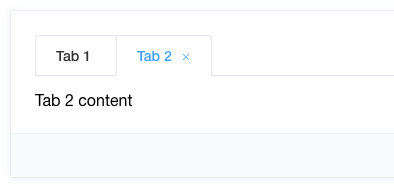

---
{
  "title": "vue tabs标签页组件的坑，能不使用就不要使用",
  "staticFileName": "vue_tabs_pit.html",
  "author": "guoqzuo",
  "createDate": "2020/08/22",
  "description": "vue tabs标签页,vue 标签页,vue便签页的坑，最近项目中需要在一个页面中打开多个tab标签页，刚才是觉得element有现成的组件，觉得没啥问题，后面发现迭代维护新功能时真的是大坑。个人建议**能不使用tab标签页的情况，就不要使用**，下面来看看需要注意的地方",
  "keywords": "vue tabs标签页,vue 标签页,vue便签页的坑",
  "category": "Vue"
}
---
# vue tabs标签页组件的坑，能不使用就不要使用

最近项目中需要在一个页面中打开多个tab标签页，刚才是觉得element有现成的组件，觉得没啥问题，后面发现迭代维护新功能时真的是大坑。

个人建议**能不使用tab标签页的情况，就不要使用**，下面来看看需要注意的地方



## 不要使用el-tab-pane插槽
不要使用el-tabs里面el-tab-pane的插槽，如果是多个组件切换或加keep-alive钩子函数逻辑会比较怪，建议el-tabs只用来做顶部tab，内容切换自己控制，不要使用 el-tab-pane插槽写法

```html
<el-tabs v-model="activeName" @tab-click="handleClick">
    <el-tab-pane label="用户管理" name="first">用户管理</el-tab-pane>
    <el-tab-pane label="配置管理" name="second">配置管理</el-tab-pane>
    <el-tab-pane label="角色管理" name="third">角色管理</el-tab-pane>
    <el-tab-pane label="定时任务补偿" name="fourth">定时任务补偿</el-tab-pane>
</el-tabs>

<!-- 分开 -->
<el-tabs v-model="activeName" @tab-click="handleClick">
    <el-tab-pane label="用户管理" name="first"></el-tab-pane>
    <el-tab-pane label="配置管理" name="second"></el-tab-pane>
    <el-tab-pane label="角色管理" name="third"></el-tab-pane>
    <el-tab-pane label="定时任务补偿" name="fourth"></el-tab-pane>
</el-tabs>
<!-- 使用动态组件切换tab内容-->
<component :is="activeName"></component>
```

## 同组件tab切换时使用watch

组件打开一次后，created已执行，再打开一个tab时，不会触发created或mounted，**需要用watch监听prop传值的改变进行一些请求接口的初始化操作，如果组件还有子组件，也需要这样做，防止数据不刷新的问题**


## 刷新页面保存已打开tab列表
当刷新网页时，我们暂时没有保存已打开tabs记录，会回到首页。对于这种情况，如果产品需要就需要考虑了。

## 同组件tab来回切取消请求问题
点击一个tab后，如果请求比较慢，再点击另一个tab，数据可能会乱，**注意tab切换时，取消发出的请求**

## activated与watch同时触发避免多次请求 
使用keep-alive包裹组件，不同组件切换触发 activated 钩子，如果打开过一个详情页。在列表页再打开一个详情页，会同时触发 watch、activated，需要注意刷新逻辑，防止多次请求，需要用个变量来标记，只执行一次

## 同组件有表单时，建议只能打开一个
如果修改详情信息可以打开多个，那多个表单的数据肯定会串，很麻烦。最好一次只能打开一个修改页面，打开多个没必要。

综上，看起来简单，其实后面逻辑越加越多时，会变的很不好维护，需要考虑的问题会比较多

