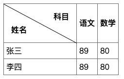

# css表格怎么画斜线，怎么精准计算斜线rotate角度
在最近的需求中，有个表格表头里有斜线，我特意翻了 HTML5权威指南 的笔记，发现并没有介绍怎么画表头的斜线。找了下网上的实现，一般都是通过 css 来实现，使用 after 或者特定 span 画一条直线，然后通过 rotate 来旋转成斜线效果。这里涉及到怎么计算斜线角度，会用到一点点数学的知识



在线预览地址: [表格画斜线 | github](https://zuoxiaobai.github.io/fedemo/src/DebugDemo/%E8%A1%A8%E6%A0%BC%E6%80%8E%E4%B9%88%E7%94%BB%E6%96%9C%E7%BA%BF/index.html)


先来看两个数学公式

1. 计算斜线的长度。勾股定理 a² + b² = c²

```css
/* 斜边边长 */
/* Math.sqrt(Math.pow(width, 2) + Math.pow(height, 2)) */
/* Math.sqrt(Math.pow(150, 2) + Math.pow(80, 2)) = 170 */
```

2. 根据th单元格的宽高计算斜线的rotate角度。给定直角三角形的边长，怎么计算角度? 这里我们知道宽高，不知道斜边边长,假设角度A，正切tanA = 对边(高) / 邻边(宽)，我们知道这个角度A的正切值，怎么反向计算A的角度呢。就需要用到反正切函数 Math.atan了，他会返回一个弧度值。在JS中 180度对应的值为 Math.PI，计算出来的值乘以 (180 / Math.PI) 就是可以在css中使用的度数了，单位为 deg

```css
/* 角度计算公式 */ 
/*  Math.atan(height / width) * 180 / Math.PI  */
/*  Math.atan(80 / 150) * 180 / Math.PI  = 28.072486935852954 */
```

完整代码如下

```html
<!DOCTYPE html>
<html lang="en">
<head>
  <meta charset="UTF-8">
  <meta name="viewport" content="width=device-width, initial-scale=1.0">
  <title>Document</title>
  <style>
    /* 基本表格元素 */
    table {
      border-collapse: collapse;
    }
    th,td {
      border: 1px solid #666;
      padding: 5px;
    }

    /* th单元格 */
    .slash-wrap {
      position: relative;
      box-sizing: border-box;
      width: 150px;
      height: 80px;
    }

    /* 斜线 */
    .slash {
      position: absolute;
      display: block;
      top: 0;
      left: 0;
      /* 斜边边长 */
      /* Math.sqrt(Math.pow(width, 2) + Math.pow(height, 2)) */
      /* Math.sqrt(Math.pow(150, 2) + Math.pow(80, 2)) = 170 */
      width: 170px;
      height: 1px;
      background-color:#000;
      /* 旋转角度计算公式 */ 
      /*  Math.atan(height / width) * 180 / Math.PI  */
      /*  Math.atan(80 / 150) * 180 / Math.PI  = 28.072486935852954 */
      transform: rotate(28.072486935852954deg); 
      transform-origin: top left;
    }

    /* 左下角文字 */
    .left {
      position: absolute;
      /* 左下角 left:0; bottom: 0; */
      left: 15px;
      bottom: 15px;
    }

    /* 右上角文字 */
    .right {
      position: absolute;
      /* 右上角 right:0; top: 0; */
      right: 15px;
      top: 15px;
    }
  </style>
</head>

<body>
  <div>
    <table>
      <tr>
        <th class="slash-wrap">
          <span class="left">姓名</span>
          <span class="slash"></span>
          <span class="right">科目</span>
        </th>
        <th>语文</th>
        <th>数学</th>
      </tr>
      <tr>
        <td>张三</td>
        <td>89</td>
        <td>80</td>
      </tr>
      <tr>
        <td>李四</td>
        <td>89</td>
        <td>80</td>
      </tr>
    </table>
  </div>
</body>

</html>
```

参考：
- [Math.atan | MDN](https://developer.mozilla.org/zh-CN/docs/Web/JavaScript/Reference/Global_Objects/Math/atan)
- [【数学】sin cos tan分别是什么意思](https://zhidao.baidu.com/question/1734209350028464467.html)
- [有边长怎么计算三角形的角度](https://zhidao.baidu.com/question/1049676482244639019.html)
- [在线三角形的角度计算器](https://tool.520101.com/calculator/sanjiaoxingjiaodu/)
- [vue element 表头添加斜线](https://www.cnblogs.com/zhaozhenzhen/p/12187482.html)
