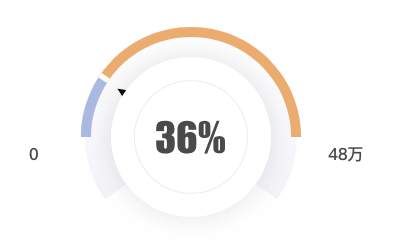

# echarts画高自定义仪表盘，echart本质是图的堆叠
最近有个UI需求，画一个自定义的仪表盘，看起来很不好实现，后面在看了echarts社区的一些例子，经过写demo测试后，找到了规律，**核心是化繁为简，对于复杂的UI，可以拆分为多个小的模块，一个个实现**



下面是一个很粗糙的测试demo，option如下，完整demo参见: [自定义仪表盘 | github](https://github.com/zuoxiaobai/fedemo/tree/master/src/vuecli-demo/src/views/echarts)

```js
var placeHolderStyle = {
  normal: {
    label: {
      show: false
    },
    labelLine: {
      show: false
    },
    color: "rgba(0,0,0,0)",
    borderWidth: 0
  },
  emphasis: {
    color: "rgba(0,0,0,0)",
    borderWidth: 0
  }
};

var bg = [
  {
    type: "pie",
    radius: "53%", // 半径
    center: [
      // 圆心
      "40%",
      "50%"
    ],
    z: 1,
    itemStyle: {
      normal: {
        color: {
          type: "linear",
          x: 0,
          y: 0,
          x2: 0,
          y2: 1,
          colorStops: [
            {
              offset: 0,
              color: "#ffffff" // 0% 处的颜色
            },
            {
              offset: 1,
              color: "#f3f4f9" // 100% 处的颜色
            }
          ],
          global: false // 缺省为 false
        },
        label: {
          show: false
        },
        labelLine: {
          show: false
        }
      }
    },
    hoverAnimation: false,
    label: {
      show: false
    },
    tooltip: {
      show: false
    },
    data: [
      {
        value: 70 // 背景部分
      },
      {
        value: 30, // 空缺部分
        itemStyle: {
          color: "transparent"
        }
      }
    ],
    startAngle: 216
  }
];

// 仪表盘外层
var roundList = [
  {
    type: "pie",
    hoverAnimation: true, //鼠标经过的特效
    radius: ["50%", "55%"],
    center: ["40%", "50%"],
    startAngle: 180,
    labelLine: {
      normal: {
        show: false
      }
    },
    label: {
      normal: {
        position: "center"
      }
    },
    data: [
      {
        value: 100, // 显示长度
        itemStyle: {
          normal: {
            color: "rgba(236,172,112, 1.0)" // 橙色 1
          }
        }
      },
      {
        value: 100, // 总长度
        itemStyle: placeHolderStyle
      }
    ]
  },

  {
    type: "pie",
    hoverAnimation: false, //鼠标经过的特效
    radius: ["50%", "55%"], // 内半径、外半径
    center: ["40%", "50%"], // 圆心坐标, 距离左侧、顶部
    startAngle: 180, // 0 为圆心左侧开始，起始角度，支持范围[0, 360]。
    labelLine: {
      normal: {
        show: false
      }
    },
    label: {
      normal: {
        position: "center"
      }
    },
    data: [
      {
        value: 11,
        itemStyle: {
          normal: {
            color: "white" // 3 紫色
          }
        }
        // label: dataStyle, 显示标签
      },
      {
        value: 100,
        itemStyle: placeHolderStyle
      }
    ]
  },

  //上层环形配置
  {
    type: "pie",
    hoverAnimation: false, //鼠标经过的特效
    radius: ["50%", "55%"], // 内半径、外半径
    center: ["40%", "50%"], // 圆心坐标, 距离左侧、顶部
    startAngle: 180, // 0 为圆心左侧开始，起始角度，支持范围[0, 360]。
    labelLine: {
      normal: {
        show: false
      }
    },
    label: {
      normal: {
        position: "center"
      }
    },
    data: [
      {
        value: 10,
        itemStyle: {
          normal: {
            color: "rgba(170,185,227,1.0)" // 3 紫色
          }
        }
        // label: dataStyle,  // label: dataStyle, 显示标签
      },
      {
        value: 100,
        itemStyle: placeHolderStyle
      }
    ]
  }
];

var pointer = [
  {
    name: "指针",
    type: "gauge",
    title: {
      show: false
    },
    detail: {
      show: false
    },
    data: [
      {
        value: 29
      }
    ],
    radius: "55%", // 内半径、外半径
    center: ["40%", "50%"], // 圆心坐标, 距离左侧、顶部
    itemStyle: {
      color: "#000"
    },
    axisLine: {
      lineStyle: {
        show: false,
        width: 0
      }
    },
    axisLabel: {
      show: false
    },
    axisTick: {
      show: false
    },
    splitLine: {
      show: false
    },
    pointer: {
      show: true,
      length: "80%",
      width: 40
    }
  }
];

var circles = [
  {
    type: "pie",
    radius: "80", // 半径
    center: [
      // 圆心
      "40%",
      "50%"
    ],
    z: 10,
    itemStyle: {
      normal: {
        color: "#fff",
        label: {
          show: true
        },
        labelLine: {
          show: false
        },
        shadowColor: "rgba(122, 122, 122, 0.21)",
        shadowBlur: 30
      }
    },
    animation: false,
    tooltip: {
      show: false
    },
    data: [
      {
        value: 36, // 背景部分
        label: {
          normal: {
            formatter: "{c}%",
            position: "center",
            show: true,
            textStyle: {
              fontSize: "40",
              fontFamily: "Impact",
              fontWeight: "normal",
              color: "#4a4a4a"
            }
          }
        }
      }
    ],
    startAngle: 0,
    text: "36%",
    textStyle: {
      color: "red"
    }
  },
  {
    name: "Line",
    type: "pie", // 圆圈
    clockWise: false,
    radius: ["28%", "28.5%"],
    center: [
      // 圆心
      "40%",
      "50%"
    ],
    z: 11,
    tooltip: {
      show: false
    },
    label: {
      show: false
    },
    animation: false,
    data: [
      {
        value: 100,
        itemStyle: {
          color: "#ececec"
        }
      }
    ]
  }
];

var texts = [];

var option = {
  backgroundColor: "#fff",
  title: [
    {
      text: "0",
      left: "13%",
      top: "51%",
      textAlign: "center",
      textStyle: {
        fontWeight: "normal",
        fontFamily: "PingFangSC-Semibold",
        fontSize: "16",
        color: "#4a4a4a",
        textAlign: "center"
      }
    },
    {
      text: "48万",
      left: "65%",
      top: "51%",
      textAlign: "center",
      textStyle: {
        color: "#4a4a4a",
        fontFamily: "PingFangSC-Semibold",
        fontWeight: "normal",
        fontSize: "16",
        textAlign: "center"
      }
    }
  ],
  series: [
    ...bg, // 背景
    ...roundList, // 最外面顶部样式
    ...pointer, // 指针
    ...circles, // 中间圆圈部分
    ...texts // 左右侧文字
  ]
};

console.log(option);
```