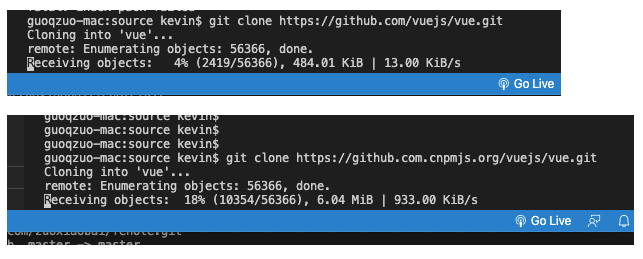

---
{
  "title": "github clone下载太慢怎么解决",
  "staticFileName": "github_clone_slow.html",
  "author": "guoqzuo",
  "createDate": "2020/09/24",
  "description": "以clone vue源码为例，默认git clone下载非常慢，我们可以把github.com链接改为镜像github.com.cnpmjs.org，这样下载速度就很快了，修改后效果对比图如下",
  "keywords": "github clone慢,github clone超时,github clone不下来",
  "category": "运维部署与版本控制"
}
---
# github clone下载太慢怎么解决
以clone vue源码为例，默认git clone下载非常慢，我们可以把github.com链接改为镜像github.com.cnpmjs.org，这样下载速度就很快了，修改后效果对比图如下



具体过程

```bash
# git clone 下载vue源码，默认情况下速度只有10k/s
guoqzuo-mac:source kevin$ git clone https://github.com/vuejs/vue.git
Cloning into 'vue'...
remote: Enumerating objects: 56366, done.
^Cceiving objects:   5% (2823/56366), 556.01 KiB | 10.00 KiB/s   
guoqzuo-mac:source kevin$ 
# 在github.com后面加上cnpmjs.org后，使用淘宝源，下载速度为 1.2M/s
guoqzuo-mac:source kevin$ git clone https://github.com.cnpmjs.org/vuejs/vue.git
Cloning into 'vue'...
remote: Enumerating objects: 56366, done.
remote: Total 56366 (delta 0), reused 0 (delta 0), pack-reused 56366
Receiving objects: 100% (56366/56366), 26.75 MiB | 1.22 MiB/s, done.
Resolving deltas: 100% (39568/39568), done.
guoqzuo-mac:source kevin$ 
```


