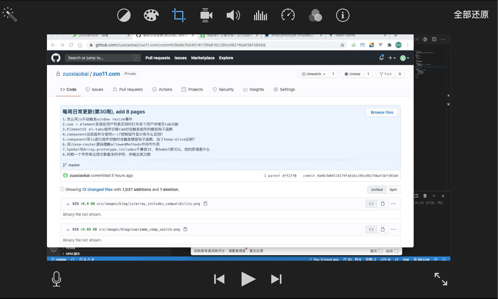
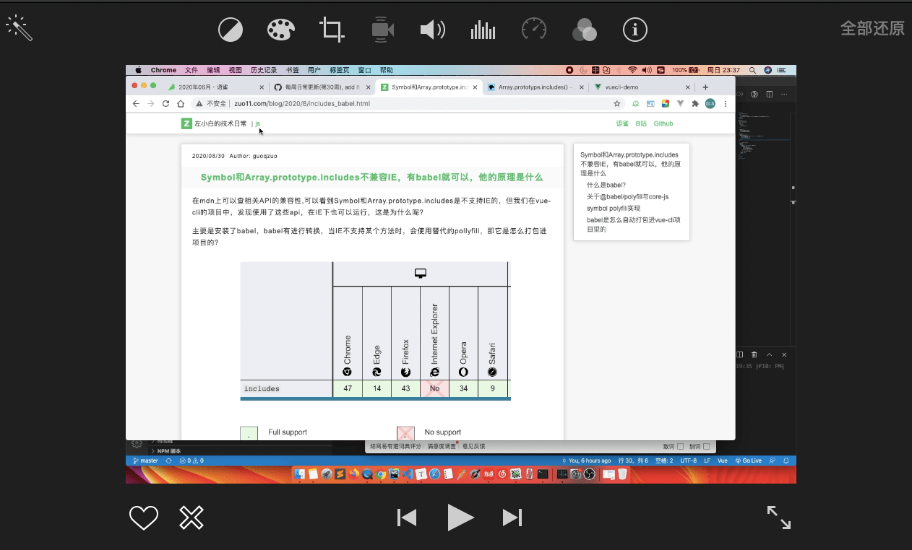

---
{
  "title": "iMovie剪辑的视频没有全屏显示，上下被截断的解决方法",
  "staticFileName": "iMovie_not_fullscreen.html",
  "author": "guoqzuo",
  "createDate": "2020/09/12",
  "description": "iMovie视频没有全屏,iMovie视频上下被截断，使用iMovie剪辑视频时，直接点击视频预览时ok的，但把视频拖动到iMovie时间轴后, 就不是全屏的了。屏幕上方和下方被截断了，注意这种情况，需要在时间轴，选中视频，然后在预览器，点击 '全部还原'，就可以了。",
  "keywords": "iMovie视频没有全屏,iMovie视频上下被截断",
  "category": "计算机基础与开发工具"
}
---
# iMovie剪辑的视频没有全屏显示，上下被截断的解决方法

使用iMovie剪辑视频时，直接点击视频预览时ok的，但把视频拖动到iMovie时间轴后, 就不是全屏的了。屏幕上方和下方被截断了

注意这种情况，需要在时间轴，选中视频，然后在预览器，点击 "全部还原"，就可以了。

