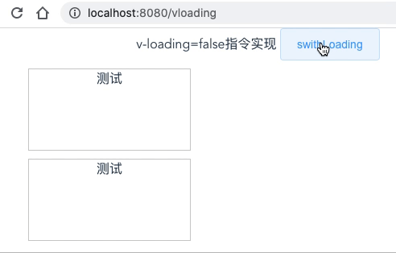

# v-loading指令的实现，怎么通过一个指令自动加骨架屏
这里需要用到vue自定义指令，我们先写个v-zloading来实现loading，在loading过程中加骨架屏

```html
<div v-zloading="loading" class="div">
  测试
</div>
```



由于是全局自定义指令，所以在main.js里写
```js
// 挂载dom
function mountDom(el) {
  el.style.position = "relative";

  let div = document.createElement("div");
  div.style.position = "absolute";
  div.style.top = "0";
  div.style.left = "0";
  div.style.right = "0";
  div.style.bottom = "0";
  div.style.backgroundColor = "white";
  div.classList.add("zloading");

  let htmlStr = `
    <div style="positon:absolute;top:0;left:0;z-index:999;width: 100%;margin: 10 auto;">
      <div class="fast-loading"></div>
      <div class="fast-loading w40"></div>
      <div class="fast-loading w80"></div>
    </div>
  `;
  div.innerHTML = htmlStr;
  el.appendChild(div);
}

Vue.directive("zloading", {
  bind: (el, binding) => {
    // console.log("v-zloading bind");
    // console.log(binding, vnode);
    if (binding.value) {
      mountDom(el);
    }
  },
  update: (el, binding) => {
    // console.log("v-zloading update");
    // console.log(el, binding, vnode);
    let zloadingDom = el.querySelector(".zloading");
    // console.log("zloading dom", zloadingDom);
    if (zloadingDom) {
      zloadingDom.style.display = binding.value ? "block" : "none";
    } else {
      binding.value && mountDom(el);
    }
  }
});
```
骨架屏的样式common.css，然后在App.vue里引入
```css
.fast-loading {
    height: 20px;
    margin: 10px 0;
    width: 200px;
    background-color: rgb(245, 245, 245);
    background-image: repeating-linear-gradient(90deg, #eee, #f5f5f5 100%);

    animation-name: fastLoading;
    animation-timing-function: linear;
    animation-duration: 1s;
    animation-iteration-count: infinite;
}
@keyframes fastLoading {
    from {
    background-position: 0 0;
    }
    to {
    background-position: 100px 0;
    }
}

.w100 { width: 100% }
.w80 { width: 80% }
.w60 { width: 60% }
.w40 { width: 50% }
.w30 { width: 30% }
```

这样就模拟实现了一个v-loading, 完整demo参见[v-zloading 实现 | github](https://github.com/zuoxiaobai/fedemo/blob/master/src/vuecli-demo/src/views/vloading/index.vue)  注意，指令的实现是放在main.js里面的


## v-loading源码
我们自己简单实现v-loaidng的功能后，再来看看v-loading的源码

```js
// 截取至element v-loading部分源码 
// https://github.com/ElemeFE/element/blob/dev/packages/loading/src/directive.js
Vue.directive('loading', {
    bind: function(el, binding, vnode) {
      //....
      const mask = new Mask({
        el: document.createElement('div'),
        data: {
          text: vm && vm[textExr] || textExr,
          spinner: vm && vm[spinnerExr] || spinnerExr,
          background: vm && vm[backgroundExr] || backgroundExr,
          customClass: vm && vm[customClassExr] || customClassExr,
          fullscreen: !!binding.modifiers.fullscreen
        }
      });
      el.instance = mask;
      el.mask = mask.$el;
      el.maskStyle = {};

      // 如果v-loading设置的值为true，挂载maskdom(toggleLoading方法)
      binding.value && toggleLoading(el, binding);
    },

    update: function(el, binding) {
      el.instance.setText(el.getAttribute('element-loading-text'));
      if (binding.oldValue !== binding.value) {
        toggleLoading(el, binding);
      }
    },

    unbind: function(el, binding) {
      if (el.domInserted) {
        el.mask &&
        el.mask.parentNode &&
        el.mask.parentNode.removeChild(el.mask);
        toggleLoading(el, { value: false, modifiers: binding.modifiers });
      }
      el.instance && el.instance.$destroy();
    }
  });
```

回过头来看看之前element UI在IE下可能会出现的两个bug

## element v-loading在IE下可能会溢出到全屏的问题
我的理解是，我觉得主要的核心在于在v-loading作用的元素上添加position:relative没有成功

```js
// ...
if (el.originalPosition !== 'absolute' && el.originalPosition !== 'fixed') {
  addClass(parent, 'el-loading-parent--relative');
}
// ...
```

## element v-loading在IE下可能会关不掉的问题
我的理解是，当binding.value有值时，它是在Vue.nextTick下次渲染周期才挂载loading的dom，如果设置true,false间隔非常快，还没在下个渲染周期，那么其实loading已经是false了，但它才开始挂载，导致关闭不了
```js
// ...
if (binding.value) {
    Vue.nextTick(() => {
      if (binding.modifiers.fullscreen) {
        el.originalPosition = getStyle(document.body, 'position');
        el.originalOverflow = getStyle(document.body, 'overflow');
        el.maskStyle.zIndex = PopupManager.nextZIndex();

        addClass(el.mask, 'is-fullscreen');
        insertDom(document.body, el, binding);
      } else {
        removeClass(el.mask, 'is-fullscreen');
// ...
```

后面有机会在 node_modules 下修改源码加上console，然后在IE下调试看看，这个是目前来说最好的方法。

参考：
- [vue自定义指令 | Vue.js](https://cn.vuejs.org/v2/guide/custom-directive.html)
- [vue自定义指令笔记 | 语雀](https://www.yuque.com/guoqzuo/yyxr05/hp742n)
