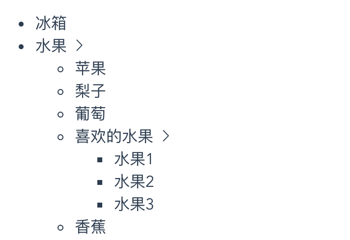

---
{
  "title": "vue递归组件，实现一个树形菜单",
  "staticFileName": "vue_tree.html",
  "author": "guoqzuo",
  "createDate": "2020/09/20",
  "description": "vue递归组件,vue树形组件,vue tree组件,vue怎么使用递归组件,vue支持递归组件，也就是组件自己调用自己，一般用于树形组件，来写个简单tree组件实例，先写好调用demo，假设我们实现了一个 z-tree 组件，我们只需要传入data就可以渲染树形组件",
  "keywords": "vue递归组件,vue树形组件,vue tree组件,vue怎么使用递归组件",
  "category": "Vue"
}
---
# vue递归组件，实现一个树形菜单
vue支持递归组件，也就是组件自己调用自己，一般用于树形组件，来写个简单tree组件实例




## 调用demo
先写好调用demo，假设我们实现了一个 z-tree 组件，我们只需要传入data就可以渲染树形组件

```html
<template>
  <div>
    <z-tree :data="treeData"></z-tree>
  </div>
</template>

<script>
export default {
  components: {
    ZTree: () => import("./ZTree")
  },
  data() {
    return {
      treeData: [
        {
          label: "冰箱"
        },
        {
          label: "水果",
          list: [
            { label: "苹果" },
            { label: "梨子" },
            { label: "葡萄" },
            {
              label: "喜欢的水果",
              list: [{ label: "水果1" }, { label: "水果2" }, { label: "水果3" }]
            },
            { label: "香蕉" }
          ]
        },
        {
          label: "茶叶",
          list: [
            { label: "铁观音" },
            { label: "西湖龙井" },
            { label: "毛尖" },
            {
              label: "红茶",
              list: [{ label: "红茶1" }, { label: "红茶2" }, { label: "红茶3" }]
            }
          ]
        }
      ]
    };
  }
};
</script>
```
## tree组件具体实现
写好demo后，再来实现ZTree.vue，注意递归组件的实用方法有两种
1. 在当前组件，使用components引入当前组件文件使用
2. 设置组件name，可以直接调用组件自己

```html
<template>
  <!-- z-tree递归组件实现 -->
  <div>
    <ul>
      <li v-for="item in data" :key="item.label">
        {{ item.label }}
        <i class="iconfont el-icon-arrow-right" v-if="item.list"></i>
        <z-tree v-if="item.list" :data="item.list"></z-tree>
      </li>
    </ul>
  </div>
</template>

<script>
export default {
  // components: {
  //   ZTree: () => import("./ZTree")
  // },
  name: "ZTree",
  props: {
    data: {
      type: Array,
      required: true
    }
  },
  data() {
    return {};
  }
};
</script>
```

## 完整代码地址
完整demo地址参见: [tree组件demo | github](https://github.com/zuoxiaobai/fedemo/tree/master/src/vuecli-demo/src/views/tree)