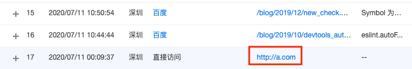

# 客户端修改host后js获取location.href不真实的问题
macOS 修改host文件 /etc/hosts 后，本地访问某个域名会按照host指定的ip去解析，就会造成前端location.href不准确的问题，下面来看看



```bash
# 默认没有写的权限，无法编辑
guoqzuo-mac:~ kevin$ ls -l /etc/hosts 
-rw-r--r--  1 root  wheel  244  3 24  2019 /etc/hosts
# 新增写的权限
guoqzuo-mac:~ kevin$ sudo chmod 0666 /etc/hosts
Password:
# 再次查看权限
guoqzuo-mac:~ kevin$ ls -l /etc/hosts 
-rw-rw-rw-  1 root  wheel  244  3 24  2019 /etc/hosts
# 使用vi修改该文件
guoqzuo-mac:~ kevin$ vi /etc/hosts
# 新增a.com解析，在本地将a.com解析到47.107.190.93的服务器，也就是zuo11.com解析到的服务器
47.107.190.93 a.com
```
macOS修改host是实时生效的，修改后，本地浏览器访问a.com，会访问47.107.190.93的服务器，显示的是zuo11.com的内容。这时用js获取location.href就是a.com，而不是zuo11.com。上面的图里是百度统计的数据，显示的就是a.com

